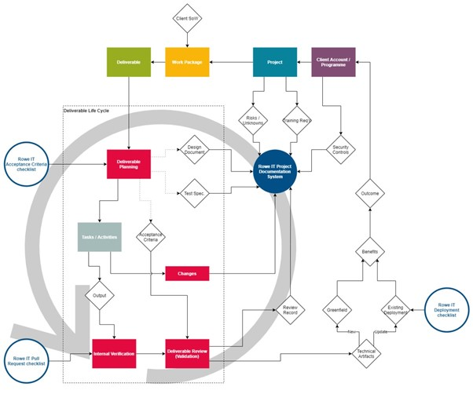

# Design and Development Procedure

**Version 1.2**

## Version Control Information

| Issue | **Description of change/Review**                 | Date       | **Author** |
| ----- | ------------------------------------------------ | ---------- | ---------- |
| 1     | Initial issue                                    | 18/02/2021 | HR         |
| 1.1   | Update to NCSC considerations                    | 3/03/2021  | HR         |
| 1.2   | Intended audience, PID clarifications, checklist | 29/03/2021 | AS         |

## Approvals

| Author:      | Andrew Scully    |
| ------------ | ---------------- |
| Approved By: | Director Rowe IT |

## Introduction

The Rowe IT Design and Development Process forms a core component of our overall Integrated Management System (IMS). The IMS aims to ensure we meet or exceed customer expectations, while accomplishing this in a secure manner sustainable for the business. 

### Purpose 

The primary goal of this process is to ensure that incoming work packages are undertaken in manner that reduces or eliminates the possibility of problems in the solution. This process is applicable in cases where Rowe IT is the party primarily responsible for producing a defined deliverable, even when we are working with individuals from outside the organisation. 

The nature of the company’s business means that the approach to the development of software will, to some extent, be determined by the client for whom the software is being developed. The purpose of this document is the describe the guiding principles that will be applied to software development activities within in the company. 

> **Note** 
>
> For the purposes of this document, a *problem* is defined broadly, as any property of the solution which could be conceived as a shortcoming by the client or an end user. A problem may be a straightforward bug, but it may also be a feature which doesn’t address an identified requirement. 

In an Agile process, there may be several rounds of iteration before a given deliverable is fully designed, implemented and tested. Documents may be repeatedly updated and referenced during this process. 

### Integration with Team Processes 

How this process is realised is somewhat dependent on the management of the particular project in flight. Using *deliverable review* as an example: 

- For Agile project teams (e.g. Scrum), deliverable review is usually undertaken during the sprint review meeting immediately after the relevant tasks are moved to “review”. 

- In an ongoing maintenance project, deliverables are more likely to be reviewed on an ad-hoc basis as and when they become available in a staging area. 

It may be the case that a project consists of a single deliverable, in which case deliverable planning may initially be undertaken once and evidence stored at the project level. 

### Key Roles 

Note that this section refers to roles rather than individuals, i.e. the responsibilities could be shared between individuals or a single individual could occupy multiple roles. 

**Quality Manager:** 

Responsible for maintaining this process and ensuring it is implemented effectively. 

**Account Manager / Product Owner:** 

Where applicable, responsible for facilitating a healthy relationship with the client, so that requirements can be gathered completely and accurately. Also responsible for gathering functional and non-functional requirements, defining user journeys and stories, and determining acceptance criteria. 

**Project Manager / Scrum Master / etc.:** 

Responsible for facilitating the delivery process and ensuring it is implemented in a manner that complies with this process, e.g. ensuring that Sprint planning and review is undertaken. 

**Technical Team:** 

Responsible for ensuring that the relevant *pull request* or *deployment* checklist is used at the appropriate process stage, e.g. that the deployment checklist is gone through prior to changing a live business system. 

*The account manager, project lead or PM is usually responsible for generating and maintaining the relevant project documentation, e.g. the risk register.* 

### Core Principles 

Where it is unclear how a project should be approached, these principles are intended as a guide: 

- **Appropriate:** The approach taken by the company will be appropriate to the specifics of the project, considering the needs of the client, completeness of requirements and any constraints relating to security, technology and personnel. 
- **Iterative:** The project will deliver the outcomes agreed with the client, while accepting that these may change during the project. Such changes will be recorded and tracked.
  - Clients will be encouraged to engage in an iterative approach where appropriate. 
- **Quality:** Any outcome will be of an appropriate level of quality, as agreed with the client and procedures put in place to allow the reporting and tracking of defects. 
- **Sustainable:** Where the outcome is expected to be used, supported and enhanced over time it will be designed with maintenance and sustainability in mind. 
- **Secure:** Any security requirements relating to the confidentiality, integrity and availability of data processed and stored by any software developed or used during the project will be highlighted during the project initiation.
  - Any security incidents occurring during development or in later, agreed, support phases will be recorded in line with the company’s information security polices. 

### Intended Audience 

It is the responsibility of project leads, project managers and account managers to ensure that project engineers and consultants operate in accordance with this procedure. This requires understanding and adaptation of this procedure to the project by that group. Project engineers and consultants are not expected to engage directly with this procedure, i.e. they should be steered by the project lead, PM and/or account manager appropriately. 

## Programme / Project Concerns 

Development planning carried out at the project level is typically undertaken in collaboration with client stakeholders. This may include: 

- A discussion of the high-level **activities** to be actioned and how they relate to each other (**input** and **output** dependencies). 
- Creation of project management assets, such as a work breakdown structure (WBS), a schedule, projected **milestones**, stakeholder register, etc. 
- A discussion of **interfaces** between parties, along with roles & responsibilities. 

> **Note** 
>
> Information Security concerns often fall into this category and are usually captured under our ISO 27001 system, recorded within the Project Information Document (PID). 

### Technical Identification 

Some deliverable-level technical concerns are also best considered during client account or project planning, where: 

- They do not change significantly between work packages.
- They relate to multiple work packages, e.g. how multiple outputs combine to provide a future benefit to the client over time. 
- It would not be practical to undertake them once a work package has commenced, e.g. **team training** or other activities with a lead time. 

These concerns may be addressed during early project planning, so that there is ample time for any supporting research or procurement before activities begin. For example: 

- Standards and conventions to be applied uniformly across the entire project. 
- Infrastructural requirements (e.g. TLS certificate procurement). 
- Source control arrangements. 

### Secure Development 

The confidentiality, integrity and availability of information, in all its forms, are critical to the ongoing functioning and good governance of Rowe IT. Failure to adequately secure information increases the risk of financial and reputational losses. Security should be considered a team effort throughout the development process. 

Please see the Rowe IT Information Security Policy for more information. 

Unless there is good reason not to (and this is agreed with the client), the **NCSC** guidance and principles for secure development and deployment **must** be followed: 

[https://www.ncsc.gov.uk/collection/developers](https://www.ncsc.gov.uk/collection/developers-collection)

These are summarised here: 

| #    | Principle                                                    | Description                                                  | Actions to consider                                          |
| ---- | ------------------------------------------------------------ | ------------------------------------------------------------ | ------------------------------------------------------------ |
| 1    | [Secure development is everyone's concern](https://www.ncsc.gov.uk/collection/developers-collection/principles/secure-development-is-everyones-concern) | Genuine security benefits  can only be realised when delivery teams weave security into their everyday  working practices. | - Define and articulate security requirements - Security is an essential skill for every member of a  software development team - Encourage people to raise security concerns - Promote a ‘no blame culture’ - There should be some security expertise involved in  the design and development of a project - Security should support software development |
| 2    | [Keep your security knowledge sharp](https://www.ncsc.gov.uk/collection/developers-collection/principles/keep-your-security-knowledge-sharp) | Creating code that is  capable of withstanding attack requires an understanding of attack types and  of defensive security practices. Your level of understanding in these areas  must be regularly updated if it's to remain useful. | - Be aware of common types of security threats - Make time for ongoing learning - Be responsible for security of code - Use established security components where appropriate - Share knowledge - Keep up to date with security features |
| 3    | [Produce clean & maintainable code](https://www.ncsc.gov.uk/collection/developers-collection/principles/produce-clean-maintainable-code) | If your code lacks  consistency, is poorly laid out and undocumented, you're adding to the  overall complexity of your system. | - Follow secure coding standards - Use naming conventions - Provide good supportive tooling - Maintain consistent coding style - Outline code block responsibilities - Separate secret credentials - Small regular code commits - Peer review - Document and comment consistently - Share knowledge |
| 4    | [Secure your development environment](https://www.ncsc.gov.uk/collection/developers-collection/principles/secure-your-development-environment) | There is sometimes a  perceived conflict between security and usability. This situation is  highlighted in the case of end user devices and the environments used to  support software development. | - Protect access credentials and secret keys - Risk assess any compromise and apply controls - Separate production systems from a development  environment - Apply network architecture controls   - Carry out protective monitoring of development  environment |
| 5    | [Protect your code repository](https://www.ncsc.gov.uk/collection/developers-collection/principles/protect-your-code-repository) | Your code is only as secure as the systems used to create it. As the central point at which your code is stored and managed, it's crucial that the repository is sufficiently secure. | - Use  approved and trusted repository - Consider  exposure of repository - Protect  access credentials - Separate  secret credentials from source code - Access controls applied - Include open code in risk considerations - Review all code changes - External code changes may be malicious - Ensure code is backed up |
| 6    | [Secure the build and deployment pipeline](https://www.ncsc.gov.uk/collection/developers-collection/principles/secure-the-build-and-deployment-pipeline) | Continuous integration, delivery and deployment  are modern approaches to the building, testing  and deployment of IT systems. | Use a trusted pipeline - Peer review before deployment - Control how deployments are considered - Run automatic testing - Manage credentials - Be cautious of untrusted branches, third party libraries and updates - Consider hard breaks and approvals |
| 7    | [Continually test your security](https://www.ncsc.gov.uk/collection/developers-collection/principles/continually-test-your-security) | Security testing can be manual, but it can also  be automated. | Align testing with software development lifecycle - Use simple, automated tests - Tailor testing to application - Share results - Focus specialists on testing that cannot be easily automated - Correct or remove failed tests - Build internal skills in this area - Identify slow or manual tests and move them out of the build pipeline |
| 8    | [Plan for security flaws](https://www.ncsc.gov.uk/collection/developers-collection/principles/plan-for-security-flaws) | All but the very simplest software is likely to  contain bugs, some of which may have a  security impact. | Put vulnerability management processes in place - Maintain register of security debt - Invest in security skills  - Perform root cause analysis - Share knowledge |

If you are uncertain how these guidelines apply to your current work activities, please contact your line manager 

### Data Protection by Design 

When developing new software, be mindful that all personally identifiable information (PII) must only be collected when absolutely required for the functioning of the system. 

It can be useful to ask clients for a copy of their latest Data Protection Impact Assessment (DPIA) during project initiation to assist in this process. 

Note that the Rowe IT PID contains a dedicated sheet for information processing, which should be kept up-to-date as the project continues. 

### Evidence

Programme and Project concerns are recorded within the Project Information Document (PID)[1](#_ftn1). This includes the following information relevant to Design and Development: 

- Milestones and Events. 
- Communications plan. 
- Reporting plan. 
- Decision log. 
- Risk log. 
- Data security plan. 

------

[1](#_ftnref1) This is still relevant even if the main project documentation is held on client’s systems. 

### Project Phases 

Any project will have several high-level phases: these reflect the commercial situation at different stages and the approach to the management of the project. 

#### Initiation

All projects will have an initiation phase. The purpose of this phase is to determine: 

- Overall objective of the project. 
- Identify client stakeholders. 
- Identify company and client’s roles and responsibilities. 
    - Who will be undertaking the project’s management? Additional fees may be chargeable for projects where Rowe IT manage the project. 
- How the subsequent phases will be managed. 
    - Development activities. 
        - Stakeholder engagement. 
        - Development Process. 
        - Requirements capture. 
        - Progress tracking and reporting including KPIs. 
        - Release strategy. 
        - Outcome acceptance criteria. 
    - Support activities.
        - Issue reporting and tracking including KPIs.
        - Agree service levels. 
- Identify any risks and record these in a risk log along with possible mitigations.
    - Security.
    - Technical.
    - Critical personnel (RACI chart). 
    - Commercial.
- Identify the communications channels to be used and when.
    - Regular meetings.
    - Email, messaging. 
    - Task and issue tracking. 
- Commercial. 
    - Project costs (resourcing). 
    - Capital costs.
        - Software.
        - Hardware. 
    - Operational costs.
        - Hosting. 
        - Management. 
    - Invoicing plan. 
- Identify key tools and systems to be used. 
    - Requirements.
    - Issue tracking.
    - Source control.
    - Programming languages.
    - Test tools. 

The outcome of this phase is a shared understanding between the company and the client of how the rest of the project will proceed and what the overall objective is. 

> **Is a new PID required?** 
>
> If this is the first project undertaken for a given client, a new PID will always be required. If the project is separate from any pre-existing projects for that customer or applies to a different system, a new PID should also be created. In cases where a work package builds on a previous WP, thought should be given on whether a new PID is required or whether the existing PID should be updated. This is left to the project lead’s discretion. 

#### Development

During this phase, the project will be under active management to ensure the expected outcomes are delivered. 

Rowe IT will ensure: 

- Regular communications with stakeholders via agreed and appropriate communications channels. 
- Appropriate periodic reviews of progress. 
- Deliver software releases as agreed. 
- Tracking of any new or changing requirements. 
- Communicating any new or changed risks. 
- Tracking of time spent on the project by company staff.
- Tracking of additional expenses relating to the project. 
- Accurate and timely invoicing as per agreed plan. 

This phase will end when all agreed outcomes have been delivered and accepted. 

During this phase, the PID should updated whenever a significant change takes place, e.g. a architectural decision is made, a key stakeholder is replaced, etc. 

#### Support 

This phase of the project is largely reactive with work taking place in response to issues or maintenance requirements. When the project relates to the development of a product, there may be a support phase running concurrently with a development phase to support an already released version. 

Rowe IT will ensure: 

- Issues can be reported via agreed communications channels. 
- Issues are recorded and tracked. 
- Issues are resolved in line with agreed service levels. 
- Response to new and changing security threats where appropriate. 
- Client is informed of any planned or unplanned maintenance. 

### Development Systems 

The Rowe IT development procedures must be followed when developing solutions for Rowe IT internal use or the development of solutions for clients where the adoption of a client specific development process has not previously been agreed. This process applies to any software-related intellectual property and associated files. 

The key components of the Rowe IT development process are: 

- Integrated development environment (IDE) appropriate for the language type used for the creation and testing of software source code. 
- Source Control System (SCS) for project source code management, change tracking and coordination. 
- Project Tracking Software (PTS) to track software issues and enhancement requests with the software and to track progress for ongoing developments. 

#### Integrated Development Environment (IDE) 

The IDE in use must be a recognised and well-supported solution for the language(s) being used. The IDE should be updated regularly, where this is not performed automatically. It is preferable that the same IDE is used by all team members to avoid formatting clashes. 

#### Source Control Management (SCM) 

Developed and tested software components are added or updated in the agreed SCM system. E.g. Git. All access to the source control system is over HTTPS and via designated User Accounts with strong password rules enabled. 

#### Project Tracking Software (PTS) 

Software issues and enhancements are captured, tracked and managed using the agreed PTS. E.g. Jira, Trello. All access to the source control system is over HTTPS and via designated User Accounts with strong password rules enabled. 

## Deliverable / Task concerns 

Deliverables are often contracted under a client-issued work package / statement of work etc. 

Where a work package contains more than one discrete deliverable, each undergoes a separate planning process. For Agile projects, this typically takes place on or before the relevant tasks are incorporated into a sprint. 

A given deliverable will be associated with one or more **requirements**. 

### Evidence 

The results of planning activities are recorded in a manner consistent with the project at large. For example, they can be added / attached to the relevant epic ticket. This also applies to **change requests** issued while a given deliverable is in progress. 

**Test results** are also stored and made available in a manner suitable to the project, for example they may be displayed on the relevant build server or continuous integration dashboard. 

Peer review (**code inspection**) is undertaken for each Pull Request made at the task level, with comments recorded within the relevant source control portal. Note that when Git is being used for secure source control, a single Pull Request may contain several Commits, which are reviewed together against the intended results. 

### Deliverable Planning 

For each deliverable, **at least one** of the following must be produced and recorded: 

- Acceptance Criteria. 
- Design Document. 
- Test Specification. 

### Deliverable Tracking 

Deliverables will typically be recorded in the PTS, e.g. as an “epic” in Jira. 

For new projects, the location (URL) of the PTS must now be recorded within the PID. A project portfolio (spreadsheet) is used to record the location of each active / upcoming PID. 

### Outline Development Process 

The development process for a given project is usually fairly consistent throughout, though it may need to be customised for certain deliverables. 

The process will typically involve the following steps: 

1. Software requirements in the form of features or issues are recorded in the PTS. Developers are tasked to build or update software components for one or more requirements recorded in the PTS, e.g. through prioritisation of an Agile backlog. 
2. Software and tests are developed in the IDE by the developer. The tests form part of the source code and follow the BDD (Behaviour Driven Development) testing style. 
3. The developer is responsible for updating the PTS with progress and for generating new issue records should any be identified during development and testing. 
4. When software components build without errors and are successfully tested by the developer, the software components can be added or updated in the SCM. The developer is required to update the requirement in the PTS to indicate that it is built and ready for testing. 

## Checklists

To provide a strong basis for ongoing quality, we use three checklists. These checklists are only intended to cover the basics and additional deliverable-specific checks should be undertaken when appropriate. 

### Acceptance Criteria Checklist 

Acceptance criteria provide a list of pass / fail criteria defining when a given deliverable is “done”. They are generated in collaboration with the client and/or their users. Information is usually gathered by an account manager, business analyst or product owner, who translates the requirements into tasks. For example, they may define user journeys and user stories to help understand how the solution will meet the client’s need, which can then be attached to an “epic” on the relevant Jira board. 

Acceptance Criteria: 

- Apply at the “deliverable” level, rather than project level (too broad) or task level (invisible to the end user).
  - E.g. “Add a new feature for generating reports”, as opposed to “Increase length of database field”. 
- Establish that appropriate thought has been given to the customer’s / user’s needs and that the deliverable will meet their expectations. 
- They are used for **validation**: was the correct solution built? 
- Provide an opportunity for learning: if a concern raised later on was not considered when generating acceptance criteria, we know to generate it next time. 

Acceptance criteria are highly variable depending on the nature of the deliverable, so it would not be sensible to define standard criteria for re-use. Instead, we use a **checklist** to ensure that the appropriate steps were taken when generating acceptance criteria for a given deliverable. The checklist also identifies broad areas which acceptance criteria may fall into, to ensure reasonable coverage. Some of these checks are given below. 

#### Communication 

- Were appropriate stakeholders involved in defining acceptance criteria? 
- What stakeholder groups will be able to access the defined acceptance criteria (and how)? 

#### User Experience 

- UI consistent with other relevant areas? 
- Complies with modern standards and expectations? 
- Device compatibility. 

#### Performance 

- Can these targets be achieved economically? 
- Do these targets cover areas relevant to the client or end user? 

#### Infrastructure 

- If appropriate, where does the deliverable integrate with existing client or Rowe ITmanaged systems? 
- Does the proposed infrastructure align with the policies of Rowe IT and/or the client organisation? 

#### Security 

- Data at rest secured appropriately? 
- Data in transit secured appropriately? 
- User consent considered where required? 

> **Full Checklist** 
>
> The full checklist is available @ 
>
> [https://roweit.sharepoint.com/Rowe%20IT%20Team/Playbook/Acceptance%20Criteria.aspx](https://roweit.sharepoint.com/Rowe%20IT%20Team/Playbook/Acceptance%20Criteria.aspx)

### Pull Request Checklist 

The outcome of technical tasks is often in the form of new source code, infrastructure scripts, UI designs, etc. These will usually be contributed to a source control system via a discrete submission, the terminology for which varies depending on the system in use. 

This checklist: 

- Is applied at the “task” level, or whatever unit of work applies to a given “commit” of a technical submission. 
  - E.g. For Git, applied to one *pull request* at a time. 

- Establishes that technical best practice has been followed and that there is a clear link between the changes submitted and the ongoing project. 
- Provides **verification**: was the solution built correctly? 

In cases where responsibility for technical delivery is shared between Rowe IT and the client (i.e. a mixed team), standards for technical verification need to be agreed between both parties. 

> **Full Checklist** 
>
> The full checklist is updated frequently and is available @ 
>
> [https://roweit.sharepoint.com/:w:/r/Rowe%20IT%20Team/Shared%20Documents/Software%20Engi ](https://roweit.sharepoint.com/:w:/r/Rowe IT Team/Shared%20Documents/Software Engineering/CodeReview.docx?d=w1e9bb9f0d76749d8a50f6583e2d2942f&csf=1&web=1&e=Jo05JH)

### Deployment Checklist 

Task level changes may be deployed once at a time, or many can be grouped together, depending on the development life cycle in place. 

- Applies to a given deployment of changes, e.g. upload from a *staging* or *UAT* area to a *live* or *production* area. 
- Establishes that appropriate thought has been given to the transition, especially things that could go wrong (*risks*). 

The preferred result is to have clear and documented steps, recorded in a well-known location. This should include likely failure modes and steps for correction and is usually known as a **playbook** or **runbook**. 

The playbook should clearly establish who (likely on the client side) is able to provide **authority to release** for a given change. This is the individual or approval process who is responsible for signing off the change, before it goes live. 

All deployments should be recorded as a *Milestone* within the PID. 

> **Continuous Deployment** 
>
> In a continuous deployment life-cycle, each task-level submission automatically triggers a deployment to the production environment, through a series of steps which manage the risk of a problem occurring as a result. In this case, the deployment checklist should be considered at the point the CD pipeline is designed: in effect, the pipeline itself serves as the risk mitigation for each change submitted. The relevant release authority must be satisfied that the automated checks in place meet their evaluation criteria. 

Some of these checks which may appear in a deliverables playbook are given below. 

#### Communication 

- Has an appropriate date / time been agreed with all relevant stakeholders? 
- Are they aware of any potential disruption (e.g. site downtime)? 
- Where appropriate, has a downtime warning banner been displayed? 

#### Risk Management 

- What could go wrong, and are appropriate mitigations in place? 
  - Blue / Green deployment? 

- Can we straightforwardly revert to the previous state? 
  - E.g. for a database schema change, has a snapshot been taken before it was applied? 
  - For a container change, is the old image accessible? 

> **Full Checklist** 
>
> The full checklist is available @ 
>
> [https://roweit.sharepoint.com/Rowe%20IT%20Team/Playbook/Deployment%20Checklist.asp ](https://roweit.sharepoint.com/Rowe%20IT%20Team/Playbook/Deployment%20Checklist.aspx)

### New Project / Work Package checklist 

When a new project or work package is initiated, please run through the below checklist: 

- Is there a PID in place? 
    - Is it completed? 
        - The PID should be completed as initiation continues and information is uncovered. 
        -  The PID **must** be completed by the end of initiation. o Is it located within the project folder? 
    - Where the PID is being re-used, has it been updated? 
- Is there suitable PTS (e.g. Jira) in place? 
    - Is it linked to from the PID? 
    - Has access been arranged as appropriate?
- Is secure source control in place? 
    - Has access been arranged as appropriate? 
    - Are credentials stored securely in accordance with our data security policy? 
- Account Management:
    - Is there a dedicated sheet within the relevant Project Tracker for the WP? 
    - Is there a dedicated “project” within HubPlanner for the WP? 
        - Has this been assigned against the project team members as appropriate? 
    - Do the names in both locations match up exactly?

## Continuous Improvement 

The design and development process is itself not set in stone and will need to evolve in line with the needs of Rowe IT and our clients. The process will be reviewed yearly to establish: 

- Whether it is proving effective in producing problem-free solutions. 
- Whether it is proving effective in managing the level of rework required, in cases the initial solution was not accepted. 

### Best practice evolution 

Best practice discussions and exchange is encouraged though use of the #**engineering** Slack channel. 

The above-mentioned checklists are “pinned” to this channel to enhance visibility and drive continuing debate. 

### Technical Debt 

Technical debt should be captured and documented as and when it is discovered. The information can be recorded in a location appropriate to the project, e.g. within the PTS or within the risks section of the PID. Where appropriate, technical debt should be flagged with the relevant client contact, e.g. the product owner. 
