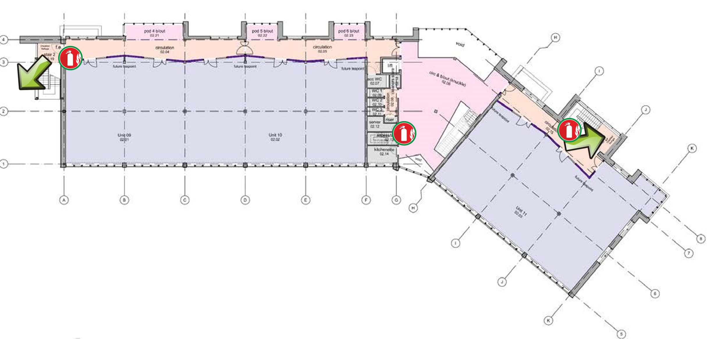
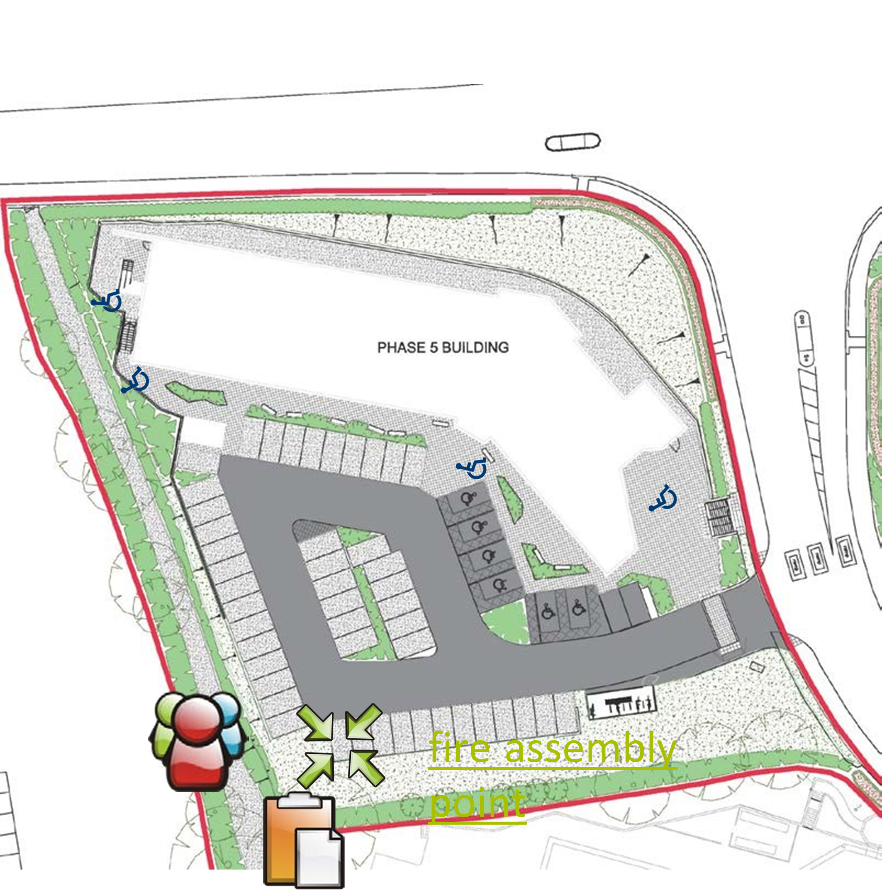

# Fire Evacuation Procedure

## If you discover a fire

- Raise the alarm.
-  Shout “FIRE, FIRE, FIRE…” and activate the nearest break glass point.
- Evacuate the building immediately by the nearest fire exit (see below for detailed procedure).

## If you are competent in using a fire extinguisher

- After you have raised the alarm you may attempt to tackle the blaze with the appropriate fire extinguisher.
- If the blaze needs more than one person and one fire extinguisher – evacuate immediately.

## If you are a fire marshal (or deputy) for your unit or building

- Supervise the evacuation of your unit, making sure associated and adjacent toilets are clear.
- Insure “buddy” processes are in place for your staff or visitors with special requirements and deploy.
- Proceed to the assembly point with your nominal roll & COSHH sheets (if relevant).
- Carry out a nominal roll call and account for all staff and visitors to your unit.
- Raise an alarm with PSP FMT Warden and/or fire brigade if you suspect persons missing.
- Report “ALL OUT” to Plymouth Science Park Fire Management Team (PSP FMT) Warden.
- Report all “buddy” processes in action to PSP FMT Warden.
- Report all Processes & Substances within your unit which may cause a heightened threat.

## If you need assistance in evacuation or are a wheelchair user

- Make sure that you have an agreed personal evacuation plan or “buddy” process to suit your needs.
- The buddy process should be agreed in advance with a competent person / fire warden associated with the building that you are visiting or working in and lodged with PSP FMT.
- Wheelchair refuge spaces in multi-story buildings on fire escape routes can be used (see plan opposite)
- If assistance is required formulating a plan please contact PSP FMT.

## Evacuation process

- On hearing the fire alarm evacuate the building immediately by the nearest fire exit.
- **DO NOT STOP TO COLLECT POSSESSIONS.**
- The nearest exit may not be the way you entered the building – familiarise yourself with the building layout.
- Follow the “running man” signs to the nearest exit.
- **DO NOT USE THE LIFTS.**
- Go to the assembly point for your building (see plan opposite).
- Make yourself known to the fire marshal for your company (or event) who will account for you on a nominal roll.
- **DO NOT LEAVE PSP UNTIL YOU ARE ACCOUNTED FOR** – you may otherwise be considered a missing person.
- Report any relevant information including location of fire and anyone suspected trapped / missing.
- **DO NOT RE-ENTER THE BUILDING** until it is declared safe by the fire brigade or a PSP FMT member.

## Response process

- When the buildings fire alarm is triggered an Alarm Receiving Centre (ARC) will call PSP FMT or the fire brigade.
- In normal working hours first response will be the PSP FMT who will investigate, coordinate resolution & communicate with company fire marshals.
- PSP FMT will be identified by high visibility jackets.
- Out of normal working hours - first response will be a PSP security guard who effectively becomes the PSP FMT Warden and / or the Fire Brigade.
- PSP FMT Warden or the Fire Brigade MUST declare BUILDING SAFE before you re-enter.
- In the event of disruption PSP Estates team will coordinate a business continuity plan relevant for those affected.
- Phase 1 reception is the emergency control & response centre.

### Phase 5 Second Floor - Fire Escape Location Plan

### Phase 5 - Fire Assembly Point Location Plan

