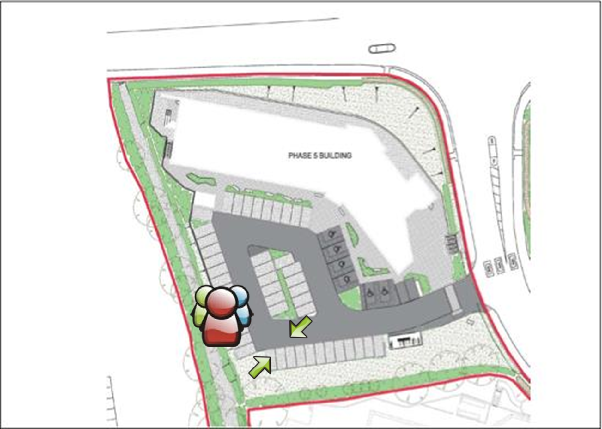

# Health and Safety Policy

## General Policy Statement 

It is the general policy of the organisation to ensure, so far as is reasonably practicable, the health, safety and welfare of our employees and of those other people who could be affected by the operation of our business. 

Further to this, we are committed to the following objectives: 

- To assess and provide adequate control of the health and safety risks arising from our work activities 
- To consult with our employees on matters affecting their health and safety 
- To manage health and safety at work and provide the necessary resource to ensure this policy is effective 
- To have access to competent advice 
- To provide and maintain safe equipment 
- To ensure safe handling and use of substances 
- To provide information, instruction and supervision for our employees taking account of those persons who do not have English as their first language 
- To ensure all employees are competent to do their tasks, and to give them adequate training 
- To prevent accidents and cases of work-related ill health 
- To maintain safe and healthy working conditions, and 
- To improve health and safety performance and management through regular review and revision of this policy when necessary, and at least annually ­­

It is the duty of management to ensure that everything is done so far as reasonably practicable to prevent personal injury in all our activities. We will strive to maintain a safe and healthy place of work for our employees, visitors, contractors, and anyone who will be present on our premises or who could be affected by our business undertakings. 

It is the duty of all employees to co-operate with the company, act responsibly, and to do everything they can to prevent injury to themselves, colleagues and others through their acts and omissions. Whilst implementation of this policy is a management responsibility, it will rely heavily on the cooperation of all employees. 

The Director has the overall and final responsibility for Health and Safety, whose commitment to its achievement is indicated by the signing of this policy statement. 

*Signed:* Director 

*Date:* 14/04/2020

## Responsibilities 

The Director has ultimate responsibility for health and safety within the organisation. In order to meet this compliance, duties have been delegated to ensure effective systems are in place. 

|                                            | Director | General  Manager /  Managers | Fire Wardens/  First Aiders |
| ------------------------------------------ | -------- | ---------------------------- | --------------------------- |
| Health and safety leadership               | ✓        | ✓                            |                             |
| Health and safety resources                | ✓        |                              |                             |
| Arrangement of competent advice            | ✓        |                              |                             |
| Health and safety target setting           | ✓        |                              |                             |
| Competence, capability and training        | ✓        | ✓                            |                             |
| Risk assessment and control                | ✓        | ✓                            |                             |
| Health and safety review                   | ✓        | ✓                            |                             |
| Management of changes in H&S               | ✓        | ✓                            |                             |
| Facilitate Health and safety consultation  | ✓        | ✓                            |                             |
| Fire safety                                | ✓        | ✓                            | ✓                           |
| Legionella control                         | ✓        |                              |                             |
| Monitoring systems                         | ✓        |                              |                             |
| Accident reporting/ investigation          | ✓        |                              |                             |
| Aggression and violence                    | ✓        |                              |                             |
| Contractor management                      | ✓        |                              |                             |
| Control of hazardous substances (COSHH)    | ✓        |                              |                             |
| Display screen equipment (DSE)             | ✓        |                              |                             |
| First aid                                  | ✓        |                              |                             |
| Health surveillance/ occupational health   | ✓        |                              | ✓                           |
| Home working / working away from home      | ✓        |                              |                             |
| Infection control                          | ✓        |                              |                             |
| Landlord’s responsibilities                | ✓        |                              |                             |
| Lone working                               | ✓        |                              |                             |
| Manual handling                            | ✓        |                              |                             |
| New and expectant mothers                  | ✓        |                              |                             |
| Occupational driving & workplace transport | ✓        |                              |                             |
| Work equipment                             | ✓        |                              |                             |
| Shift working                              | ✓        |                              |                             |
| Utilities                                  | ✓        |                              |                             |
| Visitors safety                            | ✓        |                              |                             |
| Welfare arrangements                       | ✓        |                              |                             |
| Wellbeing                                  | ✓        |                              |                             |
| Young persons                              | ✓        |                              |                             |

Overall and final responsibility for health and safety lies with Paul Rowe, Director. Day-to-day responsibility for ensuring this policy is put into practice and health and safety standards are maintained/improved lies with Hannah Rowe, General Manager. 

All employees should: 

- Co-operate with supervisors and managers on health and safety matters. 
- Take reasonable care of their own health and safety. 
- Report all health and safety concerns to an appropriate person. 

## Risk Assessment 

Rowe IT is committed to developing suitable and sufficient risk assessments of hazards associated with our business activities. All risk assessments will be kept for a minimum of three years and are available to view at any time. 

## Monitoring and Review 

We will undertake annual formal reviews of our health and safety policy to determine whether it requires revision. 

## Fire Safety Policy 

Rowe IT is committed to complying with the requirements of all applicable fire and health and safety legislation with the aim of safeguarding employees and others whilst in our premises. 

### Objectives 

- To ensure compliance with all relevant legislation 
- To liaise with the local fire authority where appropriate 
- To check fire risk assessments of our premises done by landlord 
- To communicate and practice fire procedures 
- To ensure landlord maintains firefighting equipment, fire detectors and alarm systems 

### Responsibilities of Rowe IT and landlord 

- We ensure that the fire risk assessment is recorded, and brought to the attention of all employees 
- We ensure an Emergency Fire Action Plan is recorded and is communicated to all employees 
- We ensure escape routes are clear and free from obstructions 
- We ensure that our fire policy, fire procedures, and fire risk assessments are reviewed regularly 
- We communicate our policy and fire safety measures to all employees during induction and regularly throughout their employment. We inform others as necessary such as contractors and visitors 

### Responsibilities of Employees 

- Employees must keep exits and escape routes clear from obstructions at all times 
- Employees must report to Management any adverse issues or incidents which maybe a fire hazard 
- Employees must participate in our escape drills, and any other training which is provided 

### Fire Drills 

In order to ensure people on the premises know what to do in the event of a fire, our landlords Plymouth Science Park conduct fire drills at least twice a year. They also provide fire equipment available outside the office. 

### Fire Risk Assessment 

The fire risk assessment will be completed and reviewed regularly. Appropriate training will be given to employees. It will include: 

- Action to be taken on discovering a fire 
- Measures taken to reduce risk of fire 
- Any special arrangements for staff in need of extra help 
- Evacuation procedures for the building 
- The location of firefighting equipment in our building 
- Location of escape routes 
- The importance of good housekeeping 

The final responsibility for the implementation and review of the Fire Safety Policy lies with the Director. Day to day management of the arrangements is delegated the General Manager. 

## Emergency Fire Action Plan 

For: Rowe IT, Plymouth Science Park, 1 Davy Road, Plymouth, PL6 8BX 

Date: 14th April 2020 

### How will people be warned if there is a fire: 

By hearing the alarm or by people shouting “Fire, Fire, Fire” 

### What should employees and non-employees do if they discover a fire: 

If you discover a fire: 

- Raise the alarm 
- Shout “Fire, Fire, Fire….” and activate the nearest break glass point 
- Evacuate the building immediately by the nearest fire exit 

### What should employees and non-employees do in the event of a fire: 

- After you have raised the alarm you may attempt to tackle the blaze with the appropriate fire extinguisher. 
- If the blaze needs more than one person and one fire extinguisher – evacuate immediately. 

### What are the arrangements for calling Emergency Services: 

- When the buildings fire alarm is triggered an Alarm Receiving Centre (ARC) will call PSP FMT or the fire brigade. 
- In normal working hours first response will be the PSP FMT who will investigate, coordinate resolution & communicate with company fire marshals. 

### What should the person in charge do on hearing the alarm: 

- Supervise the evacuation of your unit, making sure associated and adjacent toilets are clear. 
- Insure “buddy” processes are in place for your staff or visitors with special requirements and deploy. 
- Proceed to the assembly point with your nominal roll & COSHH sheets (if relevant). 
- Carry out a nominal roll call and account for all staff and visitors to your unit. 
- Raise an alarm with PSP FMT Warden and/or fire brigade if you suspect persons missing. 
- Report “ALL OUT” to Plymouth Science Park Fire Management Team (PSP FMT) Warden. 
- Report all “buddy” processes in action to PSP FMT Warden. 
- Report all Processes & Substances within your unit which may cause a heightened threat. 

### Procedure for evacuating the premises: 

- On hearing the fire alarm evacuate the building immediately by the nearest fire exit. 
- **DO NOT STOP TO COLLECT POSSESSIONS.** 
- The nearest exit may not be the way you entered the building – familiarise yourself with the building layout. 
- Follow the “running man” signs to the nearest exit. 
- **DO NOT USE THE LIFTS.** 
- Go to the assembly point for your building (see plan opposite). 
- Make yourself known to the fire marshal for your company (or event) who will account for you on a nominal roll. 
- **DO NOT LEAVE PSP UNTIL YOU ARE ACCOUNTED FOR** – you may otherwise be considered a missing person. 
- Report any relevant information including location of fire and anyone suspected trapped / missing. 
- **DO NOT RE-ENTER THE BUILDING** until it is declared safe by the fire brigade or a PSP FMT member. 

### Where should people assemble: 

### Procedure for checking office is empty: 

- Report “ALL OUT” to Plymouth Science Park Fire Management Team (PSP FMT) Warden. 
- Report all “buddy” processes in action to PSP FMT Warden. 

## Safety Arrangements 

### Accident and work-related ill health reporting 

All injury accidents need to recorded in the accident book. These will be investigated by management to determine the cause and any action necessary. 

If an employee informs a manager of ill health which the employee believes to be work related, it is investigated in a similar way as other incidents with occupational health advice being obtained as necessary. All accident records are filed confidentially and retained. 

Under the Reporting of Injuries, Diseases and Dangerous Occurrences Regulations (RIDDOR), the Director has responsibility to report certain work-related accidents such as: 

- Deaths 
- Major injuries 
- Injuries to members of the public or people not at work where they are taken from the scene of an accident to hospital 
- Some work-related diseases 
- Dangerous occurrences e.g.; where something happens that does not result in an injury, but could have done 
- Over-7-day injuries – where an employee or self-employed person is away from work or unable to perform their normal work duties for more than 7 consecutive days (not including the day of incapacitation – (Incapacitation means that the worker is absent or is unable to do work that they would reasonably be expected to do as part of their normal work) 

We report incidents as soon as possible and ensure we meet the set timescales below; 

- In cases of death, major injury, or dangerous occurrences, we must notify the enforcing authority without delay 
- In cases of over seven day injuries we must notify HSE within fifteen days of the incident occurring 
- In cases of disease, we must report as soon as a doctor notifies us that our employee suffers from a reportable work-related disease. 

When necessary we will report incidents and accidents using the following methods; 

- Online using the reporting forms available from [www.hse.gov.uk](http://www.hse.gov.uk/)
- Fatal or major incidents and injuries will be reported by telephone to the Incident Contact Centre on 0845 300 99 23 (open Monday to Friday 9 am to 5 pm) 

### Aggression and Violence 

Rowe IT has a zero-tolerance policy with regards to aggression and violence. We are committed to implemented measures to reduce the risk of violence. This is broadly defined as any incident in which an employee is verbally abused, threatened or assaulted in circumstances relating to their employment. 

We acknowledge this risk may be present in certain circumstances. 

We will identify if possible, situations and persons who may be at risk using our knowledge, information and experience. We will risk assess the potential for harm and implement appropriate protective measures. 

We will provide sufficient support to those involved in any incident by discussing freely the whole incident and using counselling services if appropriate. 

Where appropriate we will pursue prosecution of any offender.

### Display Screen Equipment (DSE) 

All display screen equipment (DSE) users will complete a Self-Assessment Checklist during Induction and on a periodic basis. Wherever issues are identified requiring corrective action to be taken we will seek to resolve these and obtain further advice as necessary. We recognise our obligation to provide employees with eyesight tests and corrective spectacles for DSE work if necessary. 

- We will assess workstation hazards and reduce the risk of harm by using Self-Assessment checklists within 1 week of employees starting work with the company and thereafter periodically or following change 
- Any employees who work from home will also be required to complete and return DSE selfassessments 
- We ensure workstations meet minimum requirements, which includes provision of an adjustable chair, satisfactory lighting, sufficient space and comfortable temperature levels 
- The guidance we provide to employees is to take short, frequent breaks. Each individual user has discretion over when to take their own breaks 
- We provide time and pay (where required) for regular eye tests for "users", who regularly use DSE equipment 
- Where it is determined that the employee needs spectacles to enable them to carry out work at their screens (but not for other purposes), the cost of these will be met by the company. The company reserves the right to use preferred opticians for the supply of spectacles in these circumstances. The cost will be for basic frames and the lenses recommended by the optician. If an employee wishes to have more expensive spectacles, they must pay the difference in cost. 

### Drugs and Alcohol 

Rowe IT maintains a safe, healthy and productive work environment free of the misuse of drugs, alcohol, solvents and related substances. 

Substance abuse not only impairs employee health and performance but can also create unsafe working conditions for the company. We recognise that alcohol and substance dependency is an illness and voluntary declaration will enable us to help and control risk. We try and assist those employees who come forward voluntarily with any substance abuse problem. 

In order to maintain a safe working environment an employee suspected of being “under the influence”, may be sent home and may also be subject to action under Rowe IT’s disciplinary procedure up to and including dismissal 

We reserve the right to conduct searches if there is reason to believe prohibited or restricted substances may be present on work locations. We will support the police where appropriate. The police have extensive legal powers of search including the power to carry out body searches and searches of personal effects provided there are grounds to suspect the presence of prohibited substances. 

### First Aid 

First aid is the care given before emergency medical help arrives. It can often mean the difference between life and death and it can also help prevent minor injuries becoming more serious. We will assess our first aid needs and provision and ensure adequate equipment and trained employees are maintained. We ensure that there is as a minimum: 

- A suitably stocked first aid kit 
- Adequate numbers of employees trained in first aid to take charge of first aid arrangements 

First aid trained employees take charge when someone is injured or falls ill, including calling an ambulance if required. They also look after the first aid equipment, including restocking the first aid kit. Appointed persons will ensure that supplies in the container are adequate, and sterile items have not passed their expiry dates. 

### Occupational Health 

The Company acknowledges its duty to ensure the health and wellbeing of our employees who may be affected by any incidence of ill health arising from their work activities. Subject to our risk assessment programmes we will where necessary implement systematic, regular and appropriate procedures to detect early signs of work-related ill health among employees exposed to certain health risks, and act on the results. 

We will where necessary; 

- Ensure that the development of the strategies and procedures relating to health surveillance are undertaken by competent, trained personnel and communicated to employees 
- Ensure that Managers, employees and others follow safe working procedures and rules 
- Provide and record relevant training 
- Record any health surveillance that is undertaken in a secure manner 
- Monitor and review our systems 
- Make improvements to the way we coordinate health surveillance based on our experiences of use of our systems. 

### Home Working 

The Company acknowledges its duty to ensure the health and safety at work of our employees and this includes assessment and control of the risks associated with working at home. 

We will ensure suitable and sufficient risk assessments of hazards associated with home working are undertaken to ensure the activity and work equipment does not present a hazard to others within their home so far as reasonably practicable. 

- Where we provide equipment for work purposes at home, we ensure the equipment is correct for the job being done and sufficient information and training is given on its use 
- Arrangements will be made for the equipment to be checked regularly and it will be required to be kept in a safe condition 
- We will include homeworkers in our organisation’s consultative process by agreed methods 
- We will ensure regular communication with home workers takes place 
- Our employees are instructed to cooperate with us, as their employer, in order that we can meet health and safety compliance. 

### Legionella 

The Company recognises that legionella contamination is a potential hazard to our employees and the public. We comply with our duty to consider the risks from legionella and take suitable precautions to control the risk. Infection is caused by breathing in small droplets of water contaminated by the bacteria which may cause the potentially fatal pneumonia Legionnaires’ disease. 

- We ensure a suitable and sufficient assessment of the risk of exposure to legionella bacteria from work activities and water systems on work premises is undertaken by our landlord 
- We will access competent help and advice to assist us where necessary 

### Lone Working 

Rowe IT work activities may involve instances of lone working defined by the Health and Safety Executive (HSE) as ‘those who work by themselves without close or direct supervision’. 

We acknowledge there are additional hazards associated with working alone and seek to minimise the risks posed to our employees. 

- We have undertaken risk assessments of the lone working activities and put in place risk control measures and safe systems of work 
- We have communication systems in place for lone workers which provide contact with line management 
- We have provided personal safety advice and safety instruction regarding specific situations in which they may work 
- Emergency procedures are recorded and regularly reviewed 
- Our employees have been instructed that they must immediately leave any situation in which they feel uncomfortable or at risk and that such action has the support of management 
- Work timetables and plans are recorded to ensure information on where and when our employees will be, is available to line management

### Manual Handling 

Rowe IT is committed to preventing injury caused by manual handling activities in the workplace and therefore it is the aim of the company to avoid or minimise manual handling operations so far as is reasonably practicable. 

### New and Expectant Mothers 

The Company recognises their duty under legislation to ensure the health, safety and welfare of new and expectant mothers in the workplace. A new mother is defined as being an employee whose employer has been advised in writing that she is pregnant, has given birth in the last six months or is breast feeding. We will put in place all necessary controls to safeguard the mother and unborn child so far as is reasonably practicable. 

- We include the new and expectant mothers in the risk assessment and review process 
- We ensure that the risk assessments are reviewed throughout the pregnancy and upon return to work 
- Where necessary, we will seek advice from an Occupational Health Service provider 
- Employees are required to co-operate with us in order for us to ensure the safety of the mother and unborn child so far as reasonably practicable.

### Occupational Driving 

The Company recognises the risks to employees that need to carry out occupational driving and is committed to the prevention of injury, loss of life and damage to property from work-related driving incidents. We have systems in place to ensure that any vehicle used for work purposes, including our employee’s private vehicles, are suitable for the task and safe for the purpose. 

We undertake a risk assessment of the risks to the health and safety of our employees by any driving activity on the road. 

- We ensure that all drivers have a valid licence to drive the intended vehicle 
- We ensure that the driving activities are covered by suitable and sufficient insurance 
- We ensure so far as reasonably practicable that any driver is fit for the driving expected of them 
- We ensure that wherever applicable, work scheduling does not encourage poor driving habits such as speeding or eating meals at the wheel and includes time for suitable rest periods 
- We provide drivers with safety rules which include instruction to check that all vehicles are in a road worthy condition and that the weather is suitable for such a journey 
- We prohibit the use of mobile phones while driving unless hands-free.
- Rules regarding the use of hands-free sets are given to drivers 

### Portable Electrical Appliances 

In accordance with the requirement to maintain systems to prevent danger as far as reasonably practicable, risk assessment of electrical hazards and the use of electrical work equipment is undertaken and recorded. 

- The risk assessment considers the electrical dangers to employees and others who may be affected 
- The environments in which the equipment is being used are identified and considered 
- Where identified as necessary, intrinsically safe electrical equipment is adopted 
- Suitable and sufficient controls are implemented to ensure and demonstrate the safety of all work equipment, these include visual safety checks by employees prior to use 
- The risk of faulty electrical equipment causing fire is considered and managed 
- An asset register of electrical is maintained. Where permitted, the privately-owned electrical equipment used on our premises is also subject to the inspection regime with records of visual and where appropriate, combined tests and inspections held 

### Visitors Safety 

The Company is committed to ensuring the safety of our visitors to our workplace. We will implement systems which provide the visitor, whether able bodied or disabled, and including contractors, with the reassurance that in the event of an emergency their safety and welfare will be our priority. 

- We ensure visitors are not left alone without a nominated person responsible for their safety and welfare 
- We ensure our visitors are aware of the arrangements for fire or other emergencies 

### Wellbeing 

The Company is committed to protecting the health, safety and welfare of our employees. We recognise that wellbeing is an important aspect of our lives and acknowledge the importance of identifying workplace stressors which may negatively impact on that state, through effective management. 

The Health & Safety Executive define workplace stress as ‘the process that arises where work demands of various types and combinations exceed the person’s capacity and capability to cope’. 

We endeavour to meet high management standards and the prevention of workplace stress through the implementation of: 

- Monitoring of employee workloads, work patterns and the work environment 
- Consultation with employees on all issues raised and the proposed action relating to the prevention of workplace stress 
- Support of our employees 
- Our commitment to promote positive behaviours at work to avoid conflict and ensure fairness through the implementation of policies and procedures to prevent or resolve unacceptable behaviour 
- Job descriptions which are clear and management support to ensure employees are fully informed about their role and health and safety responsibilities, in a language they understand 
- Information for all employees outlining the procedures for the resolution of any uncertainties or conflicts within their role 

### Welfare Arrangement 

Rowe IT is committed to protecting the health, safety and welfare of our employees. We endeavour to create a safe and healthy working environment for all employees: 

- HSE Law Poster is displayed 
- Employer’s Liability Insurance Certificate is accessible (Team Documents) 
- Workplace housekeeping standards are monitored 
- Eating and kitchen facilities are clean and adequate 
- Drinking water is available 
- Toilet facilities are maintained by the landlord
- Lighting is maintained by the landlord 
- Employees have sufficient workspace to undertake their work safely 
- Slips, trips and hazards are minimised 
- Access and egress is not obstructed 

### Safety Rules for Employees 

Employees receive health and safety information and instruction during their induction to the organisation. Employees will also receive the appropriate training as specified by the outcomes of risk assessments and training needs analysis. The following safety rules are designed to protect our employees and others who may be affected by our activities and form part of our Health and Safety Policy. As an employee you are required to apply these rules, in addition to any other work procedure for which you have been trained and authorised to carry out. 

**Employees must:** 

- Take reasonable care of yourself and others 
- Co-operate with the organisation in all aspects of health and safety 
- Comply with instructions for emergency procedures 
- Keep fire escape routes clear 
- Report all accidents, near misses and damage to equipment or property as soon as possible 
- Work safely and in accordance with instructions and safe systems of work 
- Report hazards and hazardous situations immediately 
- Comply with workplace signage 
- Carry out manual handling tasks as instructed 
- Inform your Management if you become pregnant 
- Co-operate with our organisation’s health surveillance arrangements 
- Inform Management of any condition or ill health which may affect your ability to work safely 
- Vehicles
  - You must report any medical condition that could affect your ability to drive
  - If you drive your own vehicle on company business you must provide when requested:
    - A valid driving licence 
    - Valid tax and insurance details 
    - Service records and valid MOT 

**Employees must not:** 

- Attempt to extinguish a fire unless trained to do so and can do so without putting themselves at risk 
- Obstruct access to fire equipment 
- Deliberately misuse, damage or interfere with anything provided for health and safety purposes 
- Remove, or disable any safety devices 
- Use any equipment which you are not authorised to use 
- Attend work under the influence of drugs or alcohol 
- Use, possess, conceal, transport, promote or sell prohibited substances whilst on company premises or in company vehicles or on client premises- these include alcohol, cannabinoids, cocaine, opiates, amphetamines, barbiturates, benzodiazepine, phencyclidine, propoxyphene, methadone, solvent and solvent based products. 

Employees may be summarily dismissed in line with the Organisation’s disciplinary procedures if they breach the safety rules and/ or commit any action which seriously endangers the health and safety of an employee or any other person whilst at work. 
