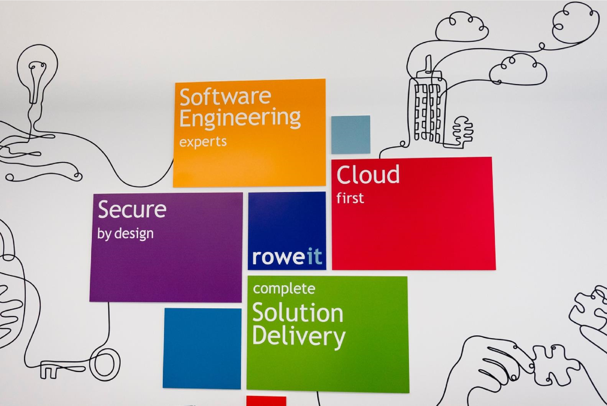
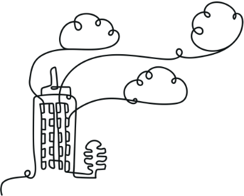
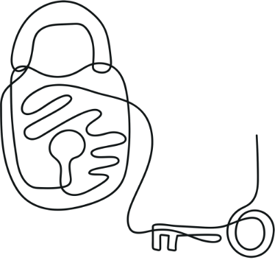

# Rowe IT Company Handbook

**16th September 2020**

## Introduction 

### WELCOME TO OUR TEAM

We would like to wish you every success during your employment whether you recently joined us or whether you are an existing employee. We hope that your experience of working here will be positive and rewarding. 

This Employee Handbook is designed both to introduce you to our organisation and to be of continuing use during your employment. 

We ask that you study carefully the contents of this Employee Handbook as, in addition to setting out our rules and regulations, it also contains information on some of the main employee benefits that may be available to you. Additional policies and procedures are available on our Sharepoint. If you require any clarification or additional information, please refer to the General Manager. 

Please note that we provide equal opportunities and are committed to the principle of equality in accordance with legislative provisions. 

We expect your support in implementing these policies. 

General amendments to the Employee Handbook will be issued from time to time. 

We look forward to working with you. 

**Paul Rowe** 

**Co-Founder & Managing Director** 

## Joining Our Organisation 

### INDUCTION

At the start of your employment with us you are required to complete an induction programme, during which all our policies and procedures (including Health and Safety) will be explained to you. Information relating to these will be given to you at the induction. 

All our policies and procedures are available to view in our Team Sharepoint. 

### JOB RESPONSIBILITIES 

Amendments may be made to your job responsibilities from time to time in relation to our changing needs and your own ability. 

### PERFORMANCE AND REVIEW 

Our policy is to support your career and growth via a continuous performance management process so that we can maximise your strengths and help you develop. This is done with 1-2-1s and captured in our HR software, Breathe. 

1-2-1s are essentially discussions led by you! Arriving with a list of things you would like to discuss will help you make the most of the time. Some ideas may include: 

1. Career and growth objectives 
2. Training or self-improvement 
3. Personal or interpersonal issues 
4. Work objectives 

### TRAVEL

It is a condition of your employment that you are willing, whenever applicable, to travel to any other of our sites or clients’ sites within reasonable travelling distance as required. This mobility is essential to the smooth running of our business. 

However, we understand that sometimes this may not be possible and will try to work with you when this requirement arises. We recognise that flexibility on both sides is key. 

### JOB FLEXIBILITY 

It may sometimes be necessary to transfer you to alternative departments, teams or duties within our business. During holiday periods, etc. it may be necessary for you to take over some duties normally performed by colleagues. This flexibility is essential for operational efficiency as the type and volume of work is always subject to change. 

## Values

Our values are important to us as they define our culture and company. We constantly review them and hope you will be part of that process. 

Our values are: 

1. Relish the challenges. They help you develop. 
2. No one knows everything. It is good to share. 
3. There is not them and us. Just one team. 
4. We are all human. Be kind and respectful. 
5. Change is good. It brings opportunities. 
6. Love what you do. 
7. Keep learning. Tomorrows skills are not todays. 

## Pay 

### ADMINISTRATION

#### Payment 

For salaried staff the pay period is the calendar month. Basic salaries are paid by 28th of each month or nearest working day after of the current month. You will receive a payslip showing how the total amount of your pay has been calculated. It will also show the deductions that have been made and the reasons for them e.g. Income Tax, National Insurance, etc. Any pay queries that you may have should be raised with the General Manager. 

#### Income Tax and National Insurance 

At the end of each tax year you will be given a form P60 showing the total pay you have received from us during that year and the amount of deductions for Income Tax and National Insurance. You may also be given a form P11D showing non-salary benefits. You should keep these documents in a safe place as you may need to produce them for tax purposes. 

### TIME/WORK

Our normal hours are 0900-1730. We are happy with flexibility around when you work as long as it does not make it hard for other people to get things done and does not impact on the business. Flexibility needs to be discussed and approved by your Team Lead or Line Manager first. Please use Slack to keep the wider Team up to date. 

Team’s often have a short stand-up meeting each day. It is preferable that you attend, so if you think you are going to be late please inform your Team Lead. 

Generally, we work at our office or clients’ sites. We are happy for you to work from home a couple of days a week by arrangement with your Team Lead. Sometimes you may need to be in the office more often and not work from home. Flexibility on both sides is a good thing but the needs of the client must always be considered. 

We are happy to consider remote working requests which will always be subject to business and project requirements. Requests will be considered on an individual basis and will be reviewed if project needs change or end. This will always be discussed openly and transparently. 

All absences must be notified in accordance with the sickness reporting procedure. Consistent lateness or absence without notification or reason may result in disciplinary action and/or loss of appropriate payment. Hopefully with the ability to work flexibly this will never happen! 

### TIMESHEETS

Please can you complete and submit timesheets on HubPlanner. We often work with our clients on a time and materials basis so it is important we can accurately track and report how our time is spent on client projects. 

HubPlanner also helps with scheduling work and forecasting future capacity. Keeping your timesheet up to date is an important part of this so please could you ensure it is updated regularly, preferably daily. 

### PENSION SCHEME 

We operate a contributory pension scheme with Nest which you will be auto-enrolled into (subject to the conditions of the scheme). The scheme enables you to save for your retirement using your own money, together with tax relief and contributions from the Company. The company will contribute payments of 7.5%. You are able to opt out of this scheme. Further details are available separately.  

## Holiday Entitlement and Conditions 

### ANNUAL HOLIDAYS 

Your annual holiday entitlement is shown in your individual Statement of Main Terms of Employment. Our leave year runs from January to December 

It is our policy to encourage you to take all of your holiday entitlement in the current holiday year. Where agreed, we are happy for up to five days’ annual leave to be carried forward or for you to be paid for any untaken leave. 

### BOOKING TIME OFF 

You must complete the holiday request via HubPlanner and have it authorised before you make any firm holiday arrangements.  

Holiday dates will normally be allocated on a "first come - first served" basis whilst ensuring that operational efficiency and appropriate staffing levels are maintained throughout the year. 

If you wish to take more than two weeks consecutively, please check with the General Manager first to ensure that this doesn’t adversely affect the projects you are working on. 

To help with scheduling, we ask you give at least four weeks’ notice of your intention to take holidays of a week or more and one week’s notice for odd single days. If in doubt, check with your tech lead or line manager. 

## Sickness/Injury Payments and Conditions 

### NOTIFICATION OF INCAPACITY FOR WORK 

If you are sick, please could you let us know by 10am, or as soon as is reasonably practical. A telephone call is preferable. Also let your Team Lead know. 

You should try to give some indication of your expected return date and notify us as soon as possible if this date changes. The notification procedures should be followed on each day of absence unless you are covered by a medical certificate. 

If your incapacity extends to more than seven calendar days you are required to notify us of your continued incapacity once a week thereafter, unless otherwise agreed. 

For sickness, our HR system Breathe needs to be completed. 

### EVIDENCE OF INCAPACITY 

Medical certificates are not issued for short-term incapacity. In these cases of incapacity (up to and including seven calendar days) you must sign a self-certification absence form on your return to work. 

If your sickness has been (or you know that it will be) for longer than seven days (whether or not they are working days) you should see your doctor and make sure he/she gives you a medical certificate and forward this to us without delay. Subsequently you must supply us with consecutive medical certificates to cover the whole of your absence. 

### PAYMENTS 

Being sick is not a choice and as a company, we would always want to support you when we can. Any contractual sickness/injury payments are shown in your individual Statement of Main Terms of Employment. 

Where the circumstances of your incapacity are such that you receive or are awarded any sum by way of compensation or damages in respect of the incapacity from a third party, then any payments which we may have made to you because of the absence (including SSP) shall be repaid by you to us up to an amount not exceeding the amount of the compensation or damages paid by the third party and up to, but not exceeding, any amount paid by us. 

### RETURN TO WORK 

You should notify your Team Lead as soon as you know on which day you will be returning to work, if this differs from a date of return previously notified. 

If you have been suffering from an infectious or contagious disease or illness such as rubella or hepatitis you must not report for work without clearance from your own doctor. 

On return to work after any period of sickness/injury absence (including absence covered by a medical certificate), you are also required to complete a self-certification absence form and hand this to General Manager. 

Upon returning to work after any period of sickness/injury absence, you may be required to attend a “return to work” interview to discuss the state of your health and fitness for work. Information arising from such an interview will be treated with strictest confidence. 

### GENERAL

Submission of a medical certificate or sickness self-certification absence form, although giving us the reason for your absence, may not always be regarded by us as sufficient justification for accepting your absence. Sickness is just one of a number of reasons for absence and although it is understandable that if you are sick you may need time off, continual or repeated absence through sickness may not be acceptable to us. 

In deciding whether your absence is acceptable or not we will take into account the reasons and extent of all your absences, including any absence caused by sickness/injury. We cannot operate with an excessive level of absence as all absence, for whatever reason, reduces our efficiency. 

We will take a serious view if you take sickness/injury leave which is not genuine, and it will result in disciplinary action being taken. 

## Other Benefits 

### LIFE INSURANCE 

We provide Life Insurance at three times your salary under the terms and conditions of the group policy. 

### PRIVATE MEDICAL INSURANCE 

During your employment you can be covered by a private medical insurance scheme nominated by the Company. Subject to the conditions of the insurance policy. We reserve the right to withdraw or amend this benefit at our absolute discretion. Further details are available separately. 

Please be aware that this is considered a benefit in kind so there are tax implications. These are relatively minimal but it is something to be aware of. 

### EMPLOYEE ASSISTANCE PROGRAMME 

We recognise that sometimes you may face certain challenges in your work and home life that are  difficult to deal with. We subscribe to a confidential and professional life management service which  provides you with a qualified counsellor who can offer personal support for any practical or  emotional challenges you may be facing. The service is initially provided via telephone and online  advice but face to face meetings will be arranged where this is felt clinically appropriate. This service  is totally confidential. More details of this service are available from the General Manager.

## Safeguards

### CONFIDENTIALITY  

You are to exercise reasonable care to keep safe all documentary or other material containing confidential information, and shall at the time of termination of your employment with us, or at any other time upon demand, return to us any such material in your possession. You must make yourself aware of our policies on data protection in relation to personal data and ensure compliance with them at all times. 

### DATA PROTECTION 

The General Data Protection Regulation (GDPR) and the current Data Protection Acts regulate our use of your personal data. As an employer it is our responsibility to ensure that the personal data we process in relation to you is done so in accordance with the required principles. Any data held shall be processed fairly and lawfully and in accordance with the rights of data subjects. 

We will process data in line with our privacy notices in relation to both job applicants and employees. 

You have several rights in relation to your data. We commit to ensuring that your rights are upheld in accordance with the law and have appropriate mechanisms for dealing with such. 

We may ask for your consent for processing certain types of personal data. In these circumstances, you will be fully informed as to the personal data we wish to process and the reason for the processing. You may choose to provide or withhold your consent. Once consent is provided, you are able to withdraw consent at any time. 

You are required to comply with all company policies and procedures in relation to processing data. Failure to do so may result in disciplinary action up to and including dismissal. 

### BUILDING PASS 

You will be issued with a building pass on joining. If you lose the pass, please inform the General Manager immediately. You must not give the building pass to any third party unless authorisation is obtained from the Director. 

### CLOSED CIRCUIT TELEVISION 

Closed circuit television cameras are used on our premises for security purposes (operated by our landlord). We reserve the right to use any evidence obtained in this manner in any disciplinary issue. We will ensure all personal data obtained in this way is processed in line with the current Data Protection Act. You may refer to the employee privacy notice for more information on the data we hold, the reasons we hold it and the lawful basis which applies. 

### DISCLOSURE AND BARRING CERTIFICATE(S) 

Your initial employment is conditional upon the provision of a satisfactory Disclosure and Barring Certificate of a level appropriate to your post. You may be required to undertake subsequent criminal record checks from time to time during your employment as deemed appropriate by the Company. In the event that such certificate(s) are not supplied your employment with us will be terminated. 

Data collected about criminal convictions will be processed in line with the Data Protection Act. You may read more about the data we hold on you, why we hold it and the lawful basis that applies in the employee privacy notice. 

### CONVICTIONS AND OFFENCES 

During your employment, you are required to immediately report to the Company any convictions or offences with which you are charged, including traffic offences. Data collected about criminal convictions will be processed in line with the Data Protection Act. You may read more about the data we hold on you, why we hold it and the lawful basis that applies in the employee privacy notice. 

## Standards

### SOCIAL MEDIA

When referring to the company on social media, please could you use “Rowe IT”. If possible, it would  be good to get consistency across the board.

### EQUIPMENT

We will provide you with the appropriate equipment needed to complete your work. It is important  that this is looked after and kept secure when not in use. If you lose, damage or misplace anything  then you need to let the General Manager know. You must return all equipment when you leave the Company upon termination by either party.

You must return all equipment when you leave the Company upon termination by either party.

Failure to return equipment, or any loss or damage caused as a result of negligence, may result in a deduction from pay to cover the cost. This is something we will always discuss with you first and will be a last resort. 

### STANDARDS OF DRESS 

We have a smart/casual dress code. However business attire should be worn when meeting with clients. Clothing should be kept clean and tidy at all times. 

### HOUSEKEEPING 

Both from the point of view of safety and of appearance, work areas must be kept clean and tidy at all times. We try to provide a variety of coffee and tea but if you have any specific requirements, please let the General Manager know. 

## Health, Safety, Welfare and Hygiene 

### SAFETY

You should make yourself familiar with our Health and Safety Policy and your own health and safety duties and responsibilities. You must not take any action that could threaten the health or safety of yourself, other employees, clients or members of the public. 

You should report all accidents and injuries at work, no matter how minor, in the accident book. 

You must ensure that you are aware of our fire and evacuation procedures and the action you should take in the event of such an emergency. 

### REFRESHMENT MAKING FACILITIES 

We provide refreshment making facilities for your use, which must be kept clean and tidy at all times. 

### ALCOHOL & DRUGS POLICY 

Under legislation we, as your employer, have a duty to ensure so far as is reasonably practicable, the health and safety and welfare at work of all our employees and similarly you have a responsibility to yourself and your colleagues. The use of alcohol and drugs may impair the safe and efficient running of the business and/or the health and safety of our employees. 

If your performance or attendance at work is affected as a result of alcohol or drugs, or we believe you have been involved in any drug related action/offence, you may be subject to disciplinary action and, dependent on the circumstances, this may lead to your dismissal. 

### NO SMOKING POLICY 

Smoking on the premises is not permitted. All litter should be placed in the bins provided. You are under no circumstances permitted to smoke on client premises. Smoking is only permitted in the designated area. Whilst there is no formal allocation of smoking breaks, excessive smoking breaks are not permitted. This includes the use of e-cigarettes. 

### HYGIENE

Any exposed cut or burn must be covered with a first-aid dressing. 

If you are suffering from an infectious or contagious disease or illness such as rubella or hepatitis you must not report for work without clearance from your own doctor. 

Contact with any person suffering from an infectious or contagious disease must be reported before commencing work. 

### FITNESS FOR WORK 

If you arrive for work and, in our opinion, you are not fit to work, we reserve the right to exercise our duty of care if we believe that you may not be able to undertake your duties in a safe manner or may pose a safety risk to others to send you away for the remainder of the day. 

### MANUAL HANDLING 

You are required, in accordance with the Manual Handling Regulations 1992, to advise us of any condition which may make you more vulnerable to injury. 

### RIGHT TO DISCONNECT 

As a company we support flexible working which means some people may work unusual hours. You should feel no pressure to reply if you receive business as usual communication outside your normal day. It is important to ensure we all maintain a healthy work/life balance especially when working remotely.  

## General Terms and Procedures

### CHANGES IN PERSONAL DETAILS

You must notify us of any change of name, address, telephone number, etc., so that we can maintain  accurate information on our records and make contact with you in an emergency, if necessary,  outside normal working hours.

### OTHER EMPLOYMENT

If you already have any other employment or are considering any additional employment you must notify us so that we can discuss any implications arising from the current working time legislation. 

### TIME OFF 

Circumstances may arise where you need time off for medical/dental appointments, or for other reasons. Where possible, it is preferable that such appointments should be made outside normal working hours. If this is not possible, time off required needs to be discussed with your Team Lead. 

You can get reasonable time off for certain public duties other than jury service. This needs to be agreed beforehand. We will always try to support where we can but will have to consider how it will impact the business and whether it will be paid or unpaid.  

### PARKING

Where parking facilities have been made available to you on our premises you must ensure that you observe all of our traffic requirements e.g. speed limits, etc. To avoid congestion, all vehicles must be parked only in the designated parking areas. No liability is accepted for damage to private vehicles, however it may be caused. 

### MAIL

The Company accept no responsibility for any private mail sent to our premises. All mail received by us will be opened, including that addressed to employees. Private mail, therefore, should not be sent care of our address. No private mail may be posted at our expense. 

Occasionally it may make sense to have parcels delivered to the science park for collection. They ask that this is kept to a minimum especially around Christmas time. 

### FRIENDS AND RELATIVES CONTACT / TELEPHONE CALLS / MOBILE PHONES 

During work hours, you should discourage your friends and relatives from either calling on you in person or by telephone except in an emergency.  

Personal mobile phones should be switched to silent during working hours. Reasonable use of your personal mobile phone is permitted, any use which is deemed excessive is not permitted.  

### COMPANY MOBILE PHONES 

Reasonable personal use of company provided mobile phones is permitted in line with our Acceptable Use Policy. Therefore, any personal use deemed by the Company to be excessive may be recharged back to you. 

### BUYING OR SELLING OF GOODS 

You are not allowed to buy or sell goods on your own behalf on our premises or during your working hours. 

### CLIENT RELATIONS 

Our business involves the provision of services to clients and some of our employees are employed to perform work on behalf of those clients, sometimes on the client’s own premises. Due to this relationship, our clients may, on rare occasions, require that such an employee be removed from a job in accordance with their contract with us. In such circumstances we will investigate the reasons for such requests. 

However, if our client maintains their stance, we will then take all reasonable steps to ensure that alternative work is provided. If this is not possible, we may have no alternative but to terminate such an individual’s employment. This procedure is separate from any concurrent disciplinary matter that may need to be addressed. 

### BEHAVIOUR AT WORK 

You should behave with civility towards fellow employees, and no rudeness will be permitted towards clients or members of the public. Objectionable or insulting behaviour, or bad language will render you liable to disciplinary action. 

You should use your best endeavours to promote the interests of the business and shall, during normal working hours, devote the whole of your time, attention and abilities to the business and its affairs. 

Any involvement in activities which could be construed as being in competition with us is not allowed. 

### BEHAVIOUR OUTSIDE WORK 

Because the business demands employees of the highest integrity we have the right to expect you to maintain these standards outside of working hours. 

Activities that result in adverse publicity to ourselves, or which cause us to lose faith in your integrity, may give us grounds for your dismissal. 

### CLIENT’S PREMISES  

Whilst visiting or working at any of our clients’ premises, it is imperative that you familiarise yourself and comply with all of their rules and requirements including (but not limited to) security, health and safety, smoking, parking, etc. 

Failure to comply with site rules could result in your removal from site and disciplinary action being taken in accordance with our disciplinary procedures. 

### COMPANY EQUIPMENT 

The Company provides equipment necessary to carry out your duties. You should keep these in good repair and take all reasonable steps to ensure that they are secure at all times. 

You must report any lost, damaged or mislaid equipment to your Manager and the General Manager. 

You must return all Company equipment upon termination of employment by either party. Failure to return equipment, or any loss or damage suffered as a result of your negligence, may result in a deduction to cover the cost of the equipment being made from monies due to you. 

### INCLEMENT WEATHER/TRAVEL ARRANGEMENT DISRUPTION 

Every reasonable effort should be made to attend work in accordance with your contract. In the event that you are unable to attend work owing to inclement weather conditions and/or severe disruption to your travel arrangements, you should report your absence through the normal absence reporting procedures.  

As we have the ability to work from home or flexibly, we do not envisage this to be an issue.  

### DRIVING LICENCE 

If driving is a necessary part of your role it is imperative that you maintain a valid driving licence suitable for the vehicle you operate at all times during your employment. 

You are required upon request to produce your driving licence to the management. We may also require you to provide us with the ability to access your driving licence details online. If at any time your licence is endorsed, or you are disqualified from driving, we must be informed immediately. 

Data collected about driving licences will be processed in line with the Data Protection Act. You may read more about the data we hold on you, why we hold it and the lawful basis that applies in the employee privacy notice. 

### FINES

We will not be held responsible for any fines (e.g. parking, speeding etc.) incurred by you whilst working for us. 

### CAR INSURANCE 

If your position requires you to use your own car for business purposes, you must ensure that your car insurance provides adequate cover. 

Proof of adequate insurance, Driving License, Tax and a MOT Certificate must be produced for scrutiny by the Company annually or at any time when so requested. 

### THIRD PARTY INVOLVEMENT 

We reserve the right to allow third parties to chair any meeting, for example disciplinary, capability, grievance, this is not an exhaustive list. 

We will seek your consent at the relevant time to share relevant ‘special categories of data’ where it is necessary for the purposes of that hearing. 

### RECORDING OF FORMAL MEETINGS 

We reserve the right to record any formal meetings whether conducted by us or a third party, a copy of the recording can be made available on request. All personal data collected for this purpose will be processed in line with the current Data Protection Act. 

## Additional Policies and Procedures 

In addition to this handbook, we have other policies and procedures available to read on our Team  Sharepoint. Key policies are summarised below:

### PEOPLE POLICIES 

1. **Discipline procedure**: Our formal way to deal with unacceptable or improper behaviour and/or performance. This will always be a last resort as we hope that through 1-2-1s we should be able to provide support and guidance for improvement before reaching this stage.

2. **Equality, inclusion and diversity policy**: Discrimination is always unacceptable, and equality of opportunity is a fundamental part of the company values. 

3. **Grievance procedure**: Provides you with a mechanism to raise any grievance relating to your employment. 

4. **Holiday, sickness and compassionate leave policy:** Reactions to bereavement may vary greatly according to individual circumstances. The setting of fixed rules for time off is therefore inappropriate. You should discuss your circumstances with the General Manager or Director and agree appropriate time off, which we will normally pay. However, up to one week per qualifying bereavement will normally be granted  

5. **Personal harassment policy and procedure**: Harassment on the grounds of age, disability, gender reassignment, marriage and civil partnership, pregnancy or maternity, race, religion or belief, sex or sexual orientation is unacceptable. 

6. **Privacy notice for employees**: This sets out the information we hold on your and the legal reasons for doing so such as bank details so we can pay you. It is important that you understand your rights under GDPR. 

7. **Time off for dependents**: You may be entitled to take a reasonable amount of unpaid time off during working hours to take action that is necessary to provide help to your dependants. Should this be necessary you should discuss your situation with your Manager who, if appropriate, will agree the necessary time off. 

8. **Parental leave policy** (covers maternity/paternity/adoption/parental leave): You may be entitled to maternity/paternity/adoption leave and pay in accordance with the current statutory provisions. If you (or your partner) become pregnant or are notified of a match date for adoption purposes you should notify your Manager at an early stage so that your entitlements and obligations can be explained to you. 

   If you are entitled to take parental leave or shared parental leave in respect of the current statutory provisions, you should discuss your needs with your Manager who will identify your entitlements and look at the proposed leave periods dependent upon your child’s/children’s particular circumstances and the operational aspects of the business. 

9. **Travel expenses policy**: We will reimburse you for any reasonable expenses incurred whilst travelling on our business. The rules relating to travelling expenses are in Sharepoint. 

10. **Lone working policy and procedure**: We will avoid the need for employees to work alone where reasonably practicable. Where it is necessary, we will endeavor to safeguard that individual. 

### HEALTH AND SAFETY POLICY 

This is an important policy which is there to ensure your safety and to make sure we meet our legal obligations. Reading it is part of your induction process. If you have any questions after the training, please ask the General Manager. 

### INFORMATION SECURITY POLICIES 

1. **Password policy:** This sets out our policy with regards to password complexity and security. 
2. **Use of public wifi policy:** This sets out our policy on using public wifi. We prefer you tether to your mobile phone if you are unsure about the security of the wifi. 
3. **Acceptable use policy:** This provides information on what is acceptable and unacceptable use of our IT equipment and mobile phones. This is an important policy as it sets out standards expected of you and as a result, we ask that you show acceptance by signing the policy. 

### QUALITY POLICY  

This outlines our commitment to meeting our quality objectives and standards as well as to continually improve. 

## WECLOME TO ROWE IT

