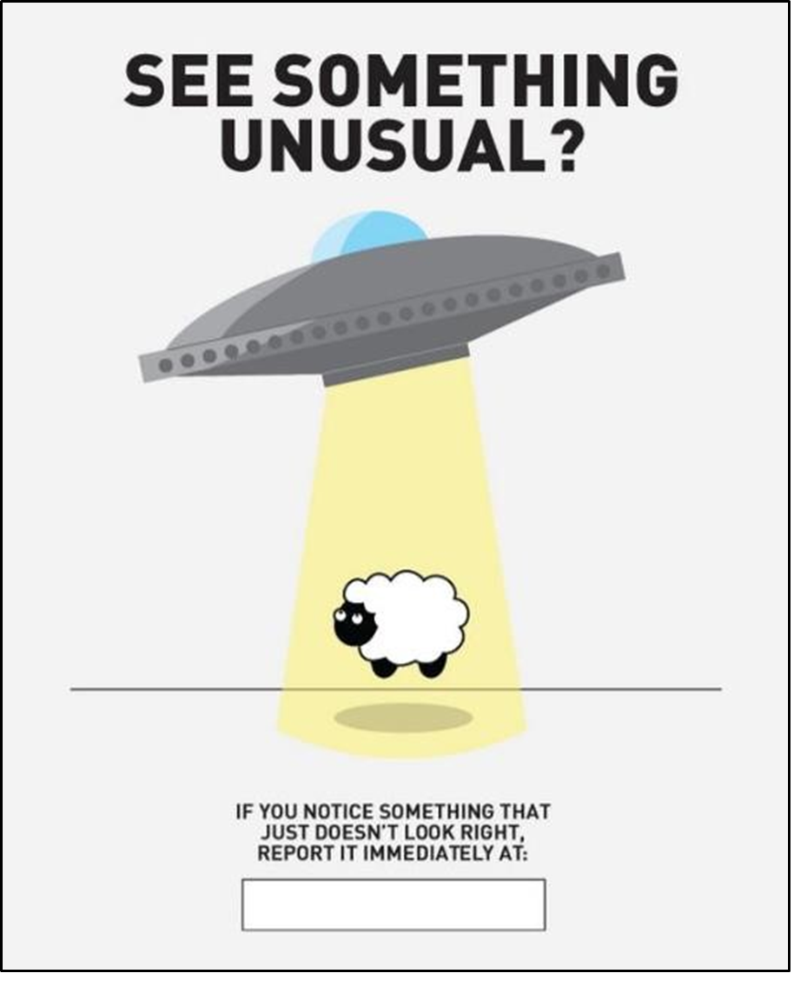
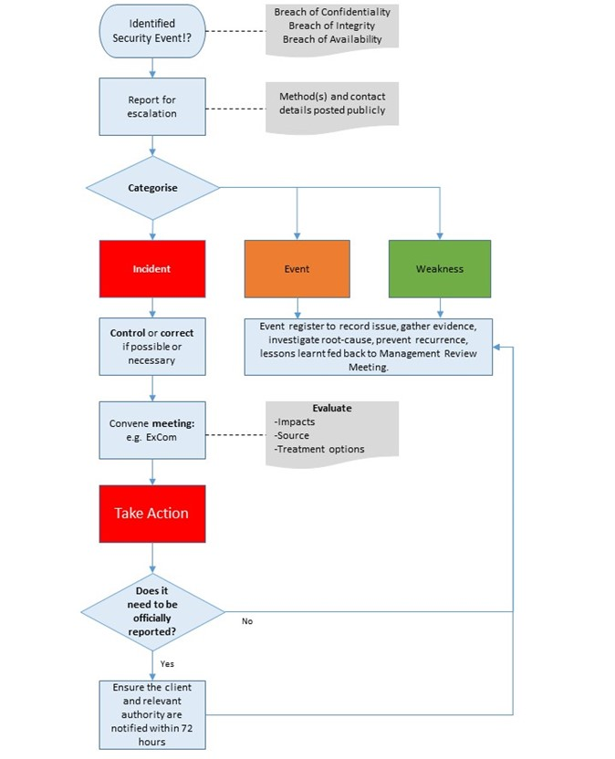



# Incident Management Policy and Procedure 

## Overview

This procedure is established to clearly define the process of managing information security incidents within Rowe IT to ensure effective reporting, response and resolution. 

**An information security incident is defined as any _event_ that actually leads to a compromise of confidentiality, integrity and/or availability of Rowe IT’s information.** 

All staff (and contractors) are required to report events or suspected events. However, it is recognised that the definition of an information security **_event_** requires clarification and clear guidance, and training are required to ensure that all staff can recognize one when they see it. 

In plain terms, an information security event is anything that could result in loss or damage to informationrelated assets, or an action that would be in breach of the organization’s security procedures; this includes 

- Malware detected on a PC or media 
- Suspicion of misuse of a system (possible hacking) 
- Theft 
- Password exposure 
- Unexpected results from system monitoring 
- Non-compliance with procedures or controls 
- Uncontrolled system changes 
- Loss of services 
- Human error 

Note: For the avoidance of doubt, relevant events do not include routine IT. During the initial triage any security-related events will be identified and escalated appropriately. 

## Reference documents 

- BS EN ISO/IEC 27001:2013 
- BS ISO/IEC 27002:2013 

## Process flow

## Reporting 

Any person at Rowe IT (including visitors or contractors) could be the first to notice a security event and quick reporting can reduce the potential cost by having it investigated quickly. In the case of system abuse, early reporting can significantly reduce the impact of the event. 

Rowe IT and its management are committed to a culture of ‘no blame’ reporting – if you see something that looks unusual and that could be a security-related event, report it. 

There are multiple ways to report a security-related event, in order of preference, these are: 

1. Slack message to Director/General Manager or on Security channel 
2. Email Director/General Manager 
3. Call Director 
4. Walk-up and discuss the concern (this can also be number 1 if we are in the office) 

## Awareness 

Rowe IT understand the importance of maintaining awareness of the company-wide reporting responsibilities and have a layered approach to ensure it stays at an appropriate and suitable level. This includes: 

- Initial training during induction (informal at present).
- All planned security workshops and presentations will contain a reminder. 
- Information shared through the Security Slack channel 

## Incident response 

All information security events are handled by the General Manager or Cyber Specialist. 

They are responsible for: 

- Communicating with the person who raised the request

  - Acknowledging the event back. 
  - Confirming the status of the event (i.e. has it been escalated to an incident) and what actions are being taken or are planned to be taken. 
  - Likely timescales. 
  - Final outcomes and, where appropriate, steps to be taken to prevent recurrence. 

- Coordinate the response including the management involvement and decision-making process. 

## Incident handling

### Primary analysis 

The first level of analysis, task management and resolution is performed in-house but if the technical competence or experience of the team is inadequate within the necessary timescales, then they will contact their nominated external specialist partner(s) and allocate tasks accordingly; this includes: 

- Mike Huthnance mjh@orbit.co.com 
- Securious 01392 247110 info@securious.co.uk 

### Collection and maintenance of evidence 

All evidence collected during the incident management process (per chain of custody best practice) shall be maintained in a secure location based on its classification and maintained in accordance with the disposal and retention schedule. 

### Information security continuous improvement 

Root cause analysis is performed on all closed incidents to continuously improve the incident management process and to prevent recurrence. 

All incidents are recorded in the Issue Log to formally record the cause analysis and corrective actions. 
