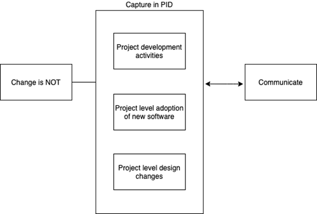



# Change Management Terms of Reference (TORs)

## Scope

The purpose of this document is to define the methods for managing changes to processes and other aspects of the Integrated Management System (IMS) in a controlled manager so as to maintain the integrity of the IMS, assign responsibility and assess the potential impacts of change.

## Types of Change 

The following diagram shows the different types of change with in the organisation and how it is managed.

## Non-Change Activities

Certain activities are not considered as “change” within the organisation. These are often business as usual activities within the project, and are managed within the project PID.

