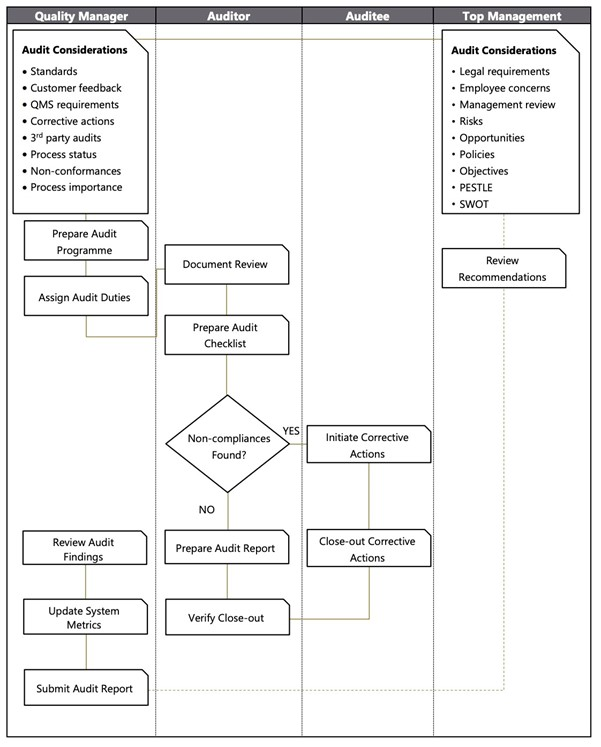

# Internal Audit Policy

## Purpose

The purpose of this procedure is to ensure that outputs that do not conform to their requirements are identified and controlled. 

## Procedure

### Audit planning 

Internal audits are planned and controlled by the General Manager. An annual audit plan is maintained so that the entire scope of ISO 27001 and ISO 9001 is covered at least once every 6 months. The audit plan and schedule takes into consideration the IMS activities as well as the results of the previous audits. The audits will be based on the documented IMS (ISO 27001 and ISO 9001) that includes policy, objectives, system procedures and other applicable documents and records. 

Before any detailed audit plan is completed, the General Manager will liaise with Senior Management to agree on timing and resourcing for the audit. This also allows an opportunity for any concerns to be raised. 

Internal audits are carried out by trained and certified auditors. At the moment, Rowe IT looks for audits to be carried out by external auditors to ensure objectivity and impartiality. 

### Auditing and reporting 

Internal audits are carried out through a process of review of documents, records, observation and interviews with people within the area being audited. The focus is on compliance, effectiveness and adequacy of the system. 

On completion, the auditor will discuss findings and agree on the identified nonconformances and observations. An Internal Audit Report will then be completed with corrective actions outlined. 

Any non-conformances will be added to the appropriate Continual Improvement Log which will make a root cause analysis, consider a corrective action plan and a target date for completion. Once actioned, the auditor will be asked to verify effective closure of nonconformances. If this is successful, the status of the non-conformance will be changed to closed in the Continual Improvement Log. 

The result of the audit is reported to the Senior Management for Management Review. 

Another audit may be requested if they are not happy. 

### Flow Chart 

