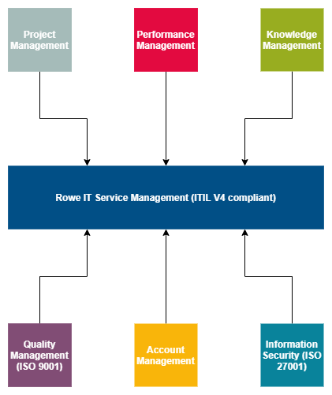
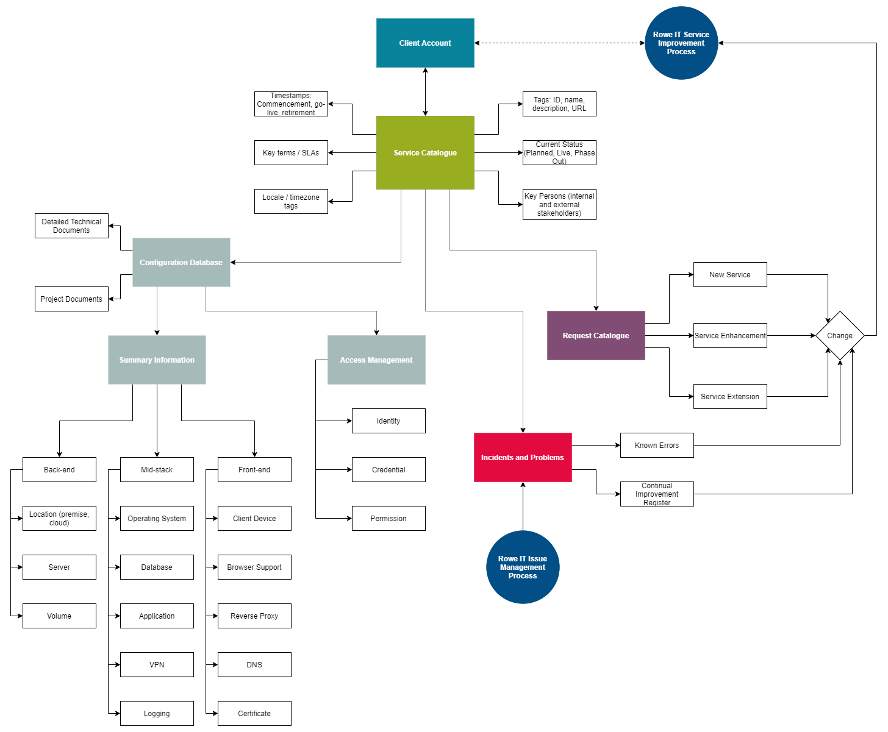
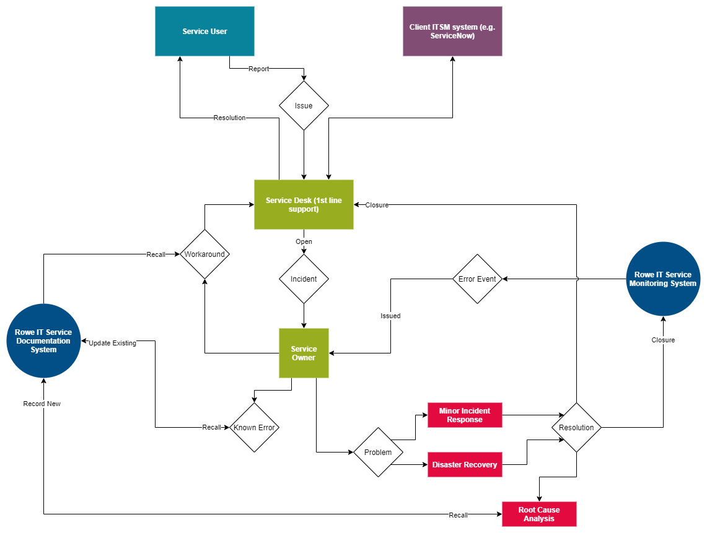
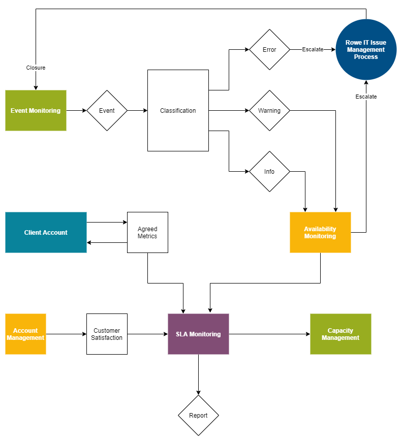
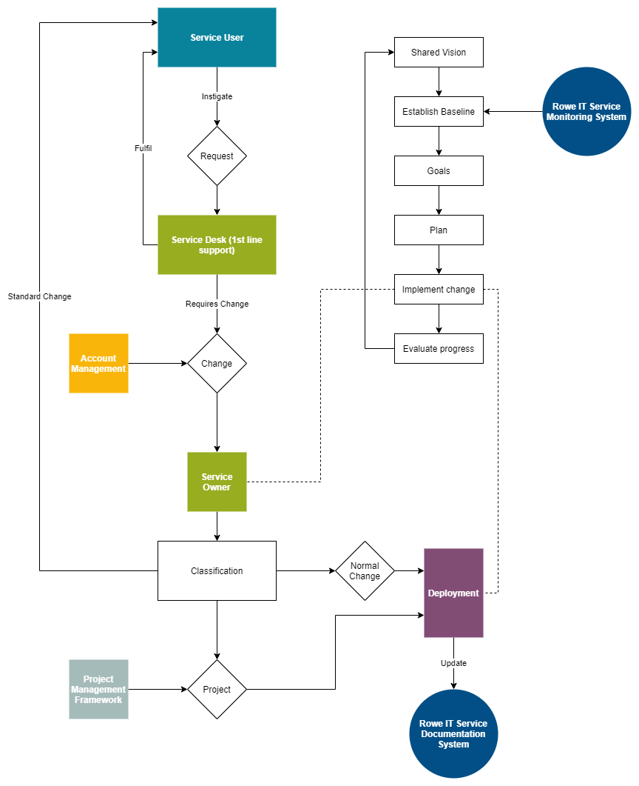

# Service Management Procedure

## Introduction 

The Rowe IT Service Management Procedure forms a core component of our overall Integrated Management System (IMS). 

### Purpose 

The IMS aims to ensure we meet or exceed customer expectations, while accomplishing this in a secure manner sustainable for the business. 

### Core Principles 

Our Service Management procedure is fully integrated with the ITIL V4 standard. This ensures that we do not place a barrier between our general management practices and our approach to Service Management, allowing us to focus as an organisation on providing value through our services. 

This procedure integrates holistically across all four dimensions of the ITIL Service Management model: 

- **Organisations and People:** Creating a culture that aligns with business objectives. Developing skills and leadership styles. Understanding how the organisation creates value. 

- **Information and Technology:** Key enabling technologies such as KMS, process management and team platforms. Management of data and information. Regulatory compliance. Cloud computing. 
- **Partners and Suppliers:** Formal contracting and flexible partnering. Purchasing strategy.
-  **Value Streams and Processes:** Workflow engineering, visibility & control, task management, goal setting. Continuous improvement approaches. 

 

Our approach to Service Management is all about building a transparent relationship with our customers so that we can create value together. 

### Integration with client processes / systems 

Since IT Service Management is typically undertaken for a particular customer, it must be implemented sympathetically with any existing procedures or systems they have in place. 

We may need to integrate with the client’s existing management systems and comply with regulatory restrictions. 

#### ITSM software 

The customer may prefer us to use their existing service management software, such as ServiceNow, as this makes it easier for their users to raise requests and issues using software they are already familiar with. We can integrate with various standard and customised fields within client ServiceNow setups, for example to follow client approval processes and reporting mechanisms. This can also be useful for SLA monitoring purposes, e.g. response times. 

#### Security 

Depending on compliance needs, we may need to limit cloud computing locations to specified geographical regions and enforce strict access controls. We may also need to securely transfer data volumes during service implementation and transition, to ensure that components are not modified between testing and deployment. Access may need to take place through a client-defined VPN. 

### Key Roles 

**Service Owner:** The individual with overall responsibility for the customer’s satisfaction with the service they are provided. Responsible for ensuring this process is properly implemented. May be undertaken by the overall Account Manager. 

**Projet Manager:** Key during a new service rollout for ensuring appropriate stakeholder engagement takes place. 

**Tech Lead:** Responsible for ensuring that robust practices are documented and adhered to. 

## IT Service Management processes and systems 

The Rowe IT Service Management procedure consists of four broad processes and systems: 

- The *Service Documentation and Configuration* system. 
- The *Issue Management* process. 
- The *Service Monitoring* process. 
- The *Service Improvement* process. 

These are described in the following chapter. 

### Service Documentation and Configuration 

Any process which requires the acquisition or retention of data, information or knowledge is covered by this system. 

  

#### Service Catalogue Management 

We maintain a single portfolio of all digital services we manage as part of our project portfolio in order to prevent fragmentation of our management approach. This takes the form of a spreadsheet within which the service description is accurately recorded using straightforward terminology that can be easily understood by a wide range of stakeholders. 

The portfolio links to the Project Information Document (PID) which contains detailed information about the service, including: owning individuals, current status, commencement date, retirement date (where known) and a summary of relevant terms / SLAs etc. The portfolio is updated by a manager whenever a change is made to a client account, such as when a new service is commissioned. Additional information is included within the catalogue database to facilitate the generation of different information as required, for example when detailed information on services sharing a technical platform is required. 

A link to the relevant ITSM software (e.g. a Jira or Trello board, Freshdesk) is also included in the PID. This can capture user requests for enhancements and new services in order to generate a request catalogue, which helps us bridge the gap between our account management and service management functions. 

#### Configuration Management 

More detailed information and technical notes are usually stored in linked documents alongside the PID, so as to keep the information accessible. This should include detailed, accurate and up-to-date data on all aspects of each services configuration. This covers configuration items, such as hardware (server specifications, locations, cloud providers and regions), software (linked libraries, OS distribution and version, security patch versions), storage (DB vendor and versions, volumes, back-up and replication strategy), key personas and roles, devices (e.g. smartphones, security modules) and suppliers (e.g. TLS certificate providers). 

Sensitive information (e.g. relating to security arrangements) must only be refrenced and made available via a different mechanism (e.g. a password vault). 

The documents must be updated every time a relevant change takes place. This keeps the 

data up-to-date as services inevitably evolve over time, reducing the risk of miscommunicated configuration from causing issues during planning or during a live incident. 

#### Access Management 

When working on a service, we must comply with relevant confidentiality and data security legislation (including GDPR and the Official Secrets Act). We are ISO27001 certified and protect our own and customers’ data using robust control mechanisms. 

For reference, the ITIL Information security management process is as follows: Prevention > Detection -> Correction. 

Our Access Control policies outline our requirements with regards to the identification of users, access to information, user access rights and special access privileges and restrictions. Our management approach is comprehensive and reviewed / audited regularly. 

It incorporates: 

- **Audit trails and logs:** As part of our ISO27001 Management System and best practice, we record, monitor and investigate events which have or may affect information assets. Security logs are reviewed regularly depending on the nature and sensitivity of the information. Logs are kept in sufficient detail and for the necessary time to ensure compliance and have reliable evidence if needed. They are accessible only by designated staff. 
- **Password management:** We take a multi layered approach to security with our password policy being the first line of defence. All passwords should be at least 10 characters with complexity. They should be unique and not reused. Wherever possible, we also require Multi Factor Authentication (MFA) to be enabled and used. As a company we use Keeper Password Manager to centrally protect and share our passwords. It enables us to manage who can access passwords to resources, the ability to enforce our password policy and provides the ability to monitor through audits and alerts. 
- **Monitoring and alerting:** Key operational systems are set up to monitor changes with real-time alerts to asset owners. 
- **Reporting:** Company wide information security training is held regularly to help ensure employees can quickly identify, monitor and rectify any weaknesses or events. All incidents are reported promptly to the Information Security Manager so the risk can be contained and prevented where possible. The Information Security Manager will then make the decision as to whether any further reporting action is needed depending upon the type and sensitivity of the incident or event. 

Access related risks are considered during the security portion of our risk assessment framework. 

#### Knowledge Management 

Internally, all data relating to Service Management is stored within our Sharepoint system in the relevant project folder. Links should be used between the contents of the folder and tickets registered in the ITSM software, as this allows straightforward searching of key concepts, for example where a problem is linked to one or more incidents. Data on key error and warning events is also stored in Sharepoint, usually in summary form to enable straightforward trend analysis. 

The usefullness of the system is reliant on the accessibility of knowledge. A given fragment of knowledge should be associated with (usually multiple) tags, which allows analysts to access relevant data quickly. Knowledge retirement policies can also be in place, so that stale entries (e.g. that have not been accessed for a period of time) are automatically archived from the system. Knowledge fragments themselves are captured from multiple locations, including support desk resolution comments (this is mandatory and entered during incident / problem closure) and the service documentation. 

### Issue Management 

The Issue Management system covers several interrelated ITIL concepts in incident/problem identification and resolution. 

  

#### Incident Management 

Strong incident resolution lies in the robust logging of issues, as this allows us to learn and become more robust. Quick identification of the underlying problem enables improved customer satisfaction and productivity for end users. A key tenet of incident management lies in finding ways to quickly work around an incident while the underlying problem is being resolved. 

We follow the ITIL 7 step process for incident handling. This begins with initial incident identification through our support desk (for user-detected incidents) or from early-detection systems. Incident logging follows this, where a detailed description of the issue is recorded together with relevant metadata (who reported, who recorded, detection timestamp) allowing later decision-making with regards to classification and prioritisation. 

At this point, initial investigation and diagnosis of the incident is undertaken, particularly where similarities to previous incidents are present. Where the incident is more complicated, the matter is escalated to the Service Owners, who may then assign or escalate the incident to a technical expert. Prioritisation is calculated using standard criteria, such as number of concurrent incidents, number of users affected and the severity of the impact on those users or related business systems. 

Once the issue reporter is satisfied and has confirmed resolution, the incident is closed and recorded for future reference in the ITSM software. 

In order to make efficient use of our client’s time, we can publish self-help documentation for the service we provide, at the location most convenient to their users. 

In the unlikely occurrence of a major incident, we must invoke any pre-agreed disaster recovery plan agreed with the client. This will usually involve close collaboration between the Rowe IT support team and service management, as well as key stakeholders identified during planning. 

> Comms with the customer: 
>
> - Nominated incident contact in PID, and number #2 / #3 
> - Named individual in PID on who should be contacted on Rowe side, and who to escalate to if they are away. 
>
> Incident report: standard template 

#### Problem Management 

Problem management is an offline process focused on identifying the underlying problems which lead to incidents, as this forms a core part of our "prevention over cure" philosophy. It focuses on reducing the occurrence and severity of incidents and the timely provision of workarounds for known errors, rather than the immediate resolution of incidents described above. 

We follow the ITIL process for problem control i.e. Problem Identification -> Problem Control -> Error control. By separating out problems (causes) from incident (impacts) in a many-tomany relationships, our processes allow both a quick return to business as usual and a concurrent analysis of any complex underlying issues, to reduce the occurrence of future incidents. Generation of a problem definition (e.g. description, stakeholders, impact, evidence) allows subsequent root cause analysis to be anchored in data.

We will measure and monitor reports of any issues reported as part of our Service Improvement process. This enables early identification of emerging problems, e.g. through trend analysis, duplicate detection, software developer insights, etc. 

#### Root Cause Analysis 

We should undertake root cause analysis (RCA) as part of our problem management system. The overall goal of the process is to understand how and why an issue appeared, so that we can prevent further occurrence. We should take a data-driven evidence-based approach to root cause analysis. Techniques such as Ishikawa ("fishbone") analysis, 5 Whys and Kepner Tregoe problem analysis may be useful. 

When a problem is first raised on our system, basic information will have been gathered (e.g. description, stakeholders, impact, evidence) to assist any subsequent deep investigation. This log is contributed to as further facts come to light, along with any further insights generated by the technical teams as the investigation continues. The final log is always recorded in the ITSM software for future reference and to evidence SLA reporting. 

Our Root Cause Analysis methodology interacts with the Rowe IT Service Documentation System, in particular the known error database (KEDB) which is recorded within the project folder on SharePoint. This allows quickly getting up-to-speed on the background of a problem: a search of the KEDB is the first step in root cause identification. We deliberately maintain a degree of separation between Root Cause Analysis and any related (or possibly related) problem or incident workflow. This is to reduce the risk of slowing down incident response. 

In-depth analysis of this type provides a rich source of data for input into service improvement endeavours. When appropriate, we record this information in the ITSM software, for consideration in the relevant team backlog (where an Agile team is in use) or project plan. 

> Where possible, use recommendations to improve disaster recovery. 

#### Service Desk 

We provide our clients with a single point of contact for reporting all issues and concerns. 

Incoming issues must be recorded in the relevant ITSM software, e.g. Freshdesk or ServiceNow. We allow contact to be performed 24/7 by voice, email and various web messaging services. 

Where a support call cannot be quickly resolved, it must be escalated to the relevant Service Owner, who applies categorisation and prioritisation (e.g. P1, P2, etc.) to the ticket. This prioritisation then dictates the ticket response times. We closely monitor the performance of our support desk to ensure we are providing the best possible support to service users and SLA obligations. 

### Service Monitoring 

Any process which involves monitoring the service in any way and responding to that input (in a manual or automated fashion) is covered by this part of the procedure. 

 

#### Event Management 

Event management is a core part of our approach to maintaining uptime of our services. It involves monitoring events generated from a variety of technical sources including front-end (web proxy logs) and back-end (DB logs) to provide a picture of service health at any one moment in time. These include events of varying significance, including informational, warnings, and errors. Recording and analysing events of all severities allows us to perform continuous trend analysis on the incoming raw data. 

Most events are processed in a purely automated manner, with alerting used for any events that fall outside of expected parameters. The service components requiring additional monitoring are dependent on the nature of the event itself: this is generally identified during incident planning. Where a warning continues, it is re-classified as an error event and escalated to the service manager accordingly. 

We can use industry standard cloud-based tools for event capture and generation, such as Grafana, Prometheus, CloudWatch and Kibana. We may use dashboards to display graphical summaries of the underlying data, access to which can also be provided to various stakeholders as required by the customer. 

#### Availability Management 

Availability begins with design. We should use lessons learned from previous experience to design in service uptime from the start. This should be backed up by continuous availability testing of the live system. 

The service owner should regularly report on mean time between failures (MTBF) and mean time to restore (MTRS) in order to drive confidence in our services. Increased emphasis must be placed on reducing failures and restoring usability for critical business functions and those which severely impact service users. Where required by the customer, we can optionally monitor availability using mechanisms such as user outage minutes and lost transactions. 

#### Capacity Management 

During the design phase, we discuss and agree with the client a definition of the high-level actions the service will be utilised for. Capacity and performance will then be expressed in these terms, e.g. how many actions of that type can be sustainably achieved by the service per hour. 

We should estimate service capacity during the service design phase and continually compare reality to the predicted baseline during testing. At this stage, we use this real-world data to derive models of future performance as a function of cost. This model allows us to establish that the service can scale economically in response to increased future demand. Once the service is live, the same mechanisms should be used to monitor ongoing performance. 

Where possible, we should make use of auto-scaling techniques and service orchestration methods, allowing services to elastically scale in line with demand without requiring manual intervention. 

#### SLA Monitoring and Reporting 

We should agree with the customer which key metrics which will be monitored as part of the Service Level Agreement (SLA) during service planning, to guarantee that the metrics used align with key business requirements. While basic metrics (such as % uptime) can be valuable, we should supplement these with additional measures which reflect the needs of the service users. Where required, we should be willing to modify the metrics in use over time to better focus on outcomes, rather than operational metrics which do not actually reflect the level of satisfaction in the service. 

We must monitor and report on SLA metrics regarding issue acknowledgement, response, and fix times for different priority incidents (P1, P2, P3 etc.). 

### Service Improvement 

 

#### Request and Change Management 

This part of the process covers a wide range of actions, including standard delivery activities (e.g. producing a report), information requests and service feedback. These requests are typically captured by our service desk or a project team member and are recorded within the project’s ITSM software. Many types of service request do not require a change to the service for them to successfully fulfilled, i.e. they can be resolved through additional user training or configuration alone. The ratio of requests to changes should be monitored in order to confirm that the service is operating flexibly enough for the stakeholders. 

The procedure for initiating, approving, fulfilling and managing requests should be formally recorded and published to a well-known location, along with a categorisation scheme. This policy will also incorporate any authorisation requirements the customer has, for example where approval is needed before a change if rolled out. 

> **Important** 
>
> On occasion, a request will require a change to the relevant service. Any change should undergo an appropriate level of risk management. This fits within our general policies for risk management, however we can customise these procedures to fit the needs of a given service. All decisions and risks should be recorded within the PID. The go-live dates of any changes must be recorded as a milestone / key date within the PID. Any changes to the system architecture should be reflected through updated technical documentation. 
>

Depending on the scale of the change, we may undertake the improvement utilising an established Project Management framework agreed with the customer. This may include integration with change governance policies as required, including sitting on change advisory boards (CABs) and attending reviews. 

> **Note** 
>
> Emergency Changes (e.g. in response to an unexpected disruption of service) are handled as part of our Issue Management Process rather than within the process described above.
>

#### Continual Improvements 

It is best to maintain an iterative approach to continual improvement in order to maintain momentum well beyond the initial service go-live. This is partly reliant on building a shared vision with the client during the planning process. This provides an opportunity for us to align our values and co-author objectives for the service partnership going forward. When available, it is best to involve senior stakeholder at this stage, to ensure that we align with the high-level direction of the client organisation. This also allows for easier business case construction in order to justify continual improvement works. 

Continual improvement requires an accurate and up-to-date baseline for each area we want to improve. This usually involves monitoring the service over a fixed period of time. The measures sometimes overlap with those used in the Service Monitoring process, making the required data immediately available. In other cases, new measures are required. Once the baseline is established, we can set SMART (Specific, Measurable, Achievable, Realistic, Time-limited) goals for improvement. 

## Miscellaneous Practices 

Service Management may entail the below disciplines in addition to the systems and processes detailed above. 

### Application Support 

May be referred to as “care and feeding” of existing systems. The usual Event Management, Availability Management, Capacity Management, SLA Monitoring and Reporting processes must be applied to non-Rowe IT software being managed. We should maintain legacy systems to the same standard as new applications and formalise any changes through our continual service improvement register, while also providing no hindrance to eventual decommissioning. 

#### Change drivers 

Ongoing development work may be driven by changes in the regulatory environment. In these cases, we must work with the client to establish the most economic course of action. These may range from software changes (e.g. introducing a cookie opt-in dialogue) to infrastructural changes (e.g. changing the geographical location of a data storage volume). Legacy systems may store personally identifiable information or other materials covered under data protection legislation. The Service Owner should review the service against regulatory changes on a regular (e.g. bi-monthly) basis to identify any relevant changes on the horizon. 

Change may also be driven from within the client organisation, e.g., a new user story. We should manage service requests through an ITSM system (e.g. ServiceNow). Fulfilment timescales should be agreed with the customer before implementation begins. Novel service requests which transpire to be incidents are transferred to our Issue Management Process. Requests which would require a change to the service itself are transferred to our Service Improvement Process. 

#### Security 

Sound security starts with solid service design principles, not just rapidly responding to new threats and software updates as they emerge. We should consider re-architecting techniques for existing services in order to improve their security and present these to the client. Be aware that his may not be economic with all legacy applications. We should use penetration testing and vulnerability scanning tools (e.g. PortSwigger) against services and schedule scans around the customer’s crucial business activity. These tools must be updated regularly with the latest threat data. 

We must use role-based access to comply with the principle of least privilege (POLP) while upholding the confidentiality, integrity and availability of client data. Access control policies must incorporate audit trails and logs, password management, monitoring & alerting and reporting on these mechanisms (as governed by our ISO27001 Information Security Management System). We should monitor system events and investigate any which may have impacted information assets. Protected logging allows us to provide evidence and ensure compliance when required. Also consider implementing standard credential polices and MFA implementations, including integration with third-party password management tools. Non-sensitive access management artifacts (e.g. authorised personnel, MFA devices) should be recorded within the project folder. Anything sensitive (e.g. credentials) must be securely stored in Keeper. 

#### Technical Monitoring 

Application performance can be monitored using available tools e.g. Amazon CloudWatch or QuickSight. Careful consideration should be given on what to monitor. This may include probing of the underlying database, file-system, related services, health checks, front-end proxies and firewalls. Be aware that teasing out which severity should be attributed to a given event often takes time and a requires full understanding of how a given condition impacts the system. 

We should also create policies for responding to categories and severities of event, including organisational roles and response criteria. This is mainly appropriate for severe events which may lead to downtime or other disruption. 

#### User Support 

We undertake application Troubleshooting, Defect Management, Incident Management and Problem Management of existing systems as part of our Issue Management Process. This should include: 

- Quick provision of workarounds. 
- Separation of incidents and problems. 
- Root cause analysis. 
- Disaster recovery planning. 
- Risk management. 
- Knowledge management. 
- Self-help provision. 

Issues can also be identified through communication with stakeholders. Complex errors undergo initial analysis before being stored within the relevant service catalogue database, after which they are subject to error control. Known errors should be regularly assessed by the Service Owner in order to generate an up-to-date picture of their ongoing impact on service users and the business. Errors with potential solutions are evaluated and will be implemented only where this can be justified on a cost/benefit basis. 

Our support SLAs may include 24/7 support via a call-centre, where on-call technical expertise is available. We may need to maintain a rota system so that an in-house specialist is always available when business critical support is required. 

### Infrastructure Operations 

Maintenance of the underlying infrastructure which one or more applications run on, most likely cloud-based. 

#### Vulnerability Management 

There are automated cloud solutions for vulnerability scanning and management, including Nessus/OpenVAS and any AWS security services. We should deploy WAF rules on AWS along with technologies such as AWS Inspector, AWS GuardDuty and other front-end security solutions such as Cloudflare, as appropriate. These technologies alert early possible intrusions and suspicious activity, allowing action before any damage occurs. 

We are an accredited ISO 27001 organisation: please follow those processes and policies for Security Information & Event Management, Access Management and other Securityrelated concerns. We are fully audited against this standard, including both our internal systems and cloud-based customer deployments. For existing implementations, we should discuss the client’s existing arrangements and document these in the project folder. 

Security and Access management is also considered as part of the following wider Rowe IT processes: 

- **Change Management:** Changes to the service may require changes to the access management approach. Our change management methodology explicitly requires consideration to any impact on security. 
- **Risk Management:** Access related risks are considered as part of the security portion of our risk assessment framework. This means that risks scored in terms of likelihood and severity, including non-financial costs such as reputational damage. 

Our specific information security processes include: Information security incident management, control review and audit, identity and access management (IAM), security event management and penetration testing / vulnerability scanning. 

#### Updates and Versioning 

Documentation in the project folder should cover the versions of all associated software (OS, open source libraries, etc.). This must be updated whenever an update takes pace. The regularity of updates is dependent on the contract with the customer and the importance of the upgrade in question e.g. a fix for a serious vulnerability should be applied a.s.a.p. 

In cases where a major dependency upgrade is required, we must agree with the client the best way forward for the business, e.g. migration, replacement, retirement. Where possible using the available infrastructure, apply a phased deployment approach (e.g. blue/green, canary release) to even minor patches, to reduce the risk of unexpected service disruption. 

Where the underlying infrastructure is maintained by another supplier, we must coordinate with them regarding any maintenance or administration matters in a timely manner. 

#### Automated Orchestration 

We should tailor our infrastructure monitoring approach depending on the nature of the deployment. When applicable, we should use cloud-native monitoring and orchestration techniques, such as Kubernetes. With legacy systems, consider deploying one or more sidecars within the existing infrastructure for collecting input data integrating this with availability assurance tooling. 

Where the client systems are deployed across more than one distinct cloud infrastructure, we should strive to achieve portability between them through standardisation. Our monitoring 

approach can take in a variety of different technologies as required, including AWS CloudWatch for data correlation. 