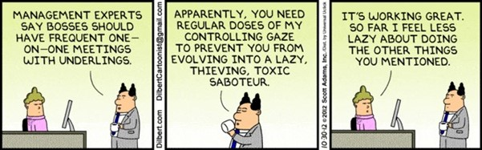
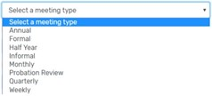
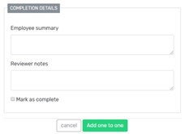
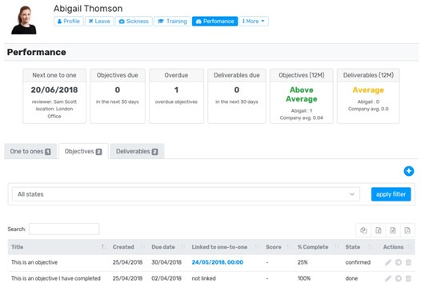
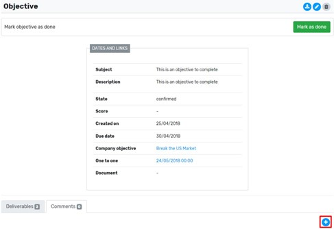



# 1-2-1 Procedure

## Purpose

The purpose of this policy is to give guidance on 1-2-1 discussion and applies to everyone in Rowe IT. 

## Why have 1-2-1s? 

1-2-1s can help strengthen relationships between managers and their team. They encourage frequent performance check-ins and conversations. This helps build trust between individuals and teams creating a safe environment to work in new and collaborative ways. 

## Preparation 

Don’t overthink the meeting, it is meant to be a discussion. The aim is to create focused collaboration time for employees and line managers to connect. It is about giving the employee time to be heard. Please try and make your appointed 1-2-1. It can create a negative impression if late or rearranged (although this sometimes can’t be helped but please just be aware of the impact this can have!) 

1-2-1s are not mandatory. If there is nothing to discuss it is ok to cancel. Sometimes it is good to acknowledge things are ok for now. 

 It is good to have a structured agenda and there will be items which will roll over. However, the agenda should be employee led. Allow them to drive at least 75% of it as it allows them to tell you what is important. Maybe also consider scheduling enough time for these conversations but don’t make them too long either.  A half-hour should be sufficient. 

 Consider location. It does not always have to be in the office. It could be done whilst walking or in the café? Obviously walking can be tricky for talking notes but does encourage conversation. 

Breathe Performance is the place to record and set 1-2-1s and Objectives. To access the 1-2-1s module, head to: 

- Employees profile > performance > one to ones > add 

- Select your preferred date and time from the calendar and then choose the type of meeting

  

- It could be good to set up a recurring monthly meeting at this stage, but you can change the dates or cancel if not needed 

- You and the employee can add notes relating to each specific 1-2-1 and mark as complete when happy

  

- Consider setting objectives to discuss at next 1-2-1. They can be linked to a 1-2-1. They also show due date, score, % of completion and state. 

  

- If you want to add comments to an objective, click into the record and scroll down to add a new comment. 

  

- Employees can suggest an objective from their dashboard which is either confirmed or rejected – although if rejected perhaps if would be better to discuss it at the 1-2-1 before doing so! 
- If you wish to add a new objective, you can do this from the performance hub within their profile 

## Agenda ideas 

- Feedback
    - What have you been doing?
    - What is on your mind this month?
    - How happy were you this month? 
    - How productive were you?
        - Objectives’ / OKRs 
        - Deliverables
    - What feedback have you got? 
    - Feedback from company? 
- Career Development
    - Training? 
    - Responsibility?

## Wrap up 

Make sure to wrap up the talking points and set an action plan to be carried out by next meeting (if relevant). Add to Breathe so you can both see what has been discussed and agreed. 

## Training 

1-2-1s are slightly different in approach as they encourage listening skills and open questions. To create an atmosphere of trust and candour is not always easy and is skill in itself. If any line manager would like training in this area, please ask. 

