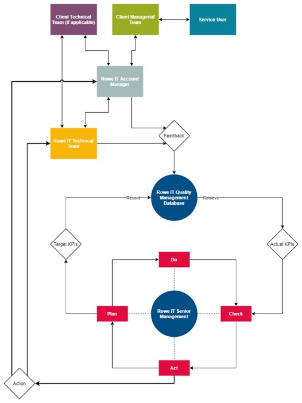

# Customer Feedback Procedure

## Introduction 

The Rowe IT Customer Feedback Procedure forms a core component of our overall Integrated Management System (IMS), which itself is ISO 9001 compliant. 

## Procedure 

The goal of this procedure is to ensure we are responsive to the needs of our customers and perform in line with (and where possible exceed) their expectations. 

## Severities of Feedback 

The system supports three severities of feedback: 

- **Compliment:** The customer gives a positive message about the service they have received. 
- **Comment:** The customer gives a neutral message about the service. 
- **Complaint:** The customer gives a negative message about the service they have received. 

A complaint is any communication where the customer expresses dissatisfaction, i.e. they do not need to express annoyance for the message to be considered a complaint. 

When a customer issues mixed feedback, the positive and negative elements are separated out and raised individually. 

## Key Roles 

### Quality Supervisor 

The quality supervisor is responsible for the day-to-day handling of customer feedback and complaint resolution. Note that the quality supervisor is a role, not an individual. When the primary supervisor is unavailable, a secondary can take over, then a tertiary, and so on. This makes the feedback system resilient to expected and unexpected absences. 

### Quality Manager 

The Quality Manager is responsible for the functioning and effectiveness of the feedback procedure. This role is responsible for periodic review of satisfaction levels, defining process improvements, creating action points and any other activity required to improve quality at Rowe IT. 

### All Staff 

In line with our overall IMS, all salaried and contract staff employed at Rowe IT are responsible for customer satisfaction. Any employee who becomes aware of any customer dissatisfaction must register it. 

## Feedback Collection 

### Granularity 

Feedback is gathered and analysed on a per customer project (as opposed to per customer) basis. This is because individual client projects may reside in entirely different areas of the organisation and may impact different stakeholders. A client may have an overall high level of satisfaction, hiding problems with one or more projects. 

### Types of feedback 

Feedback is collected in two forms: 

- **Planned:** An account manager or project lead will meet with a selection of stakeholders from the client side on a regular basis. The result of this meeting is recorded using a set of pre-defined Key Performance Indicators (KPIs). 
- **Ad-hoc:** Whenever a client issues feedback, it must be recorded immediately using the method described. 

### Planned 

Feedback is proactively sought from customers on a regular basis. The goal is to monitor potential issues before they become full-blown complaints. 

How often this takes place depends on the nature of the project and its contract value. As a guide, large and complex projects should seek feedback monthly and smaller / simpler projects quarterly. For new projects, the regularity of these meetings is agreed as part of project initiation. 

KPIs are captured by filling out the *IMS balanced scorecard*. The KPIs to be collected will be mutually agreed between the Rowe IT project team and the client: 

- There are a number of standard (*core*) metrics which are gathered for *all* customer accounts. 
- Additional metrics are added where they address a particular concern from us or the client. One additional KPI is allowed per metric area. 

The additional KPIs can be adjusted at any time in response to changing need, e.g.: 

- To ensure we have responded to a customer concern. 
- To ensure a given project is still working for Rowe IT as a business. 

> **Note** 
>
> Core KPIs cannot be removed on a per-project basis. Removal of a core KPI must cover all ongoing projects, so constitutes an adjustment to the overall feedback system 

While capturing the KPIs in a timely fashion is crucial for the functioning of the IMS, the main goal of the IMS balanced scorecard is to encourage discussion between the client and Rowe IT stakeholders in relation to the ongoing health of the contract. This also gives an opportunity to provide feedback in the other direction if required, e.g. if invoices are consistently being paid late. 

Each project has a nominated individual responsible for arranging the feedback capture sessions, ensuring engagement and recording the outcome in the IMS balanced scorecard. This will typically be the account manager or project lead. 

### Ad-hoc 

Ad-hoc customer feedback is recorded in the PID by the Project Lead or in the appropriate location as described in the PID. This is then raised via email or slack to the General Manager who will take appropriate action. Regardless of your role in the organization and which customer it relates to, you should register **all** feedback with your Project or Technical Lead. 

Depending on the nature of the feedback, a number of actions may be taken by the Quality Manager: 

- Delegate the matter to the relevant account manager or project lead for subsequent resolution. 
- Communicate with the customer and propose an appropriate business resolution. 
- Take no action, other than to record the matter for future use. 

### Planned 

Every quarter, common scorecard KPIs are gathered into a single summary scorecard for the period being studied, which is then stored alongside the aggregated scorecards from previous periods.

> **Note** 
>
> Any additional (client specific) KPIs are summarised into the single indicator for that metric group to allow analysis across the client base, since these metrics are likely to vary significantly between projects so cannot be directly compared. 

### Output Data 

The aggregated *planned* and *ad-hoc* data is a key input into the Quality Management PDCA (Plan, Do, Check, Act) cycle, described below. 

The incoming new data is compared to data from previous periods and informs the quality manager, e.g. allowing improvement targets to be set. 

## PDCA

In this section, *action* refers to an activity undertaken in response to analysis of the quality data generated for a given study period, as opposed to an action taken to resolve a particular complaint. 

### Plan

Incoming quality data is used by the Quality Manager to understand ongoing organisational effectiveness is meeting customer requirements. 

The quality manager may issue improvement targets in response to: 

- Higher than acceptable amount of negative feedback. 
- Overall feedback scores below the target threshold. 

The cost of quality is an important consideration in the target setting process: improving customer satisfaction must be accomplished in a way that is sustainable for the organisation. 

### Do

Where a disparity exists between the target and actual KPIs, action points are issued by the quality manager to drive change. 

Action points may include (but are not limited to): 

- More regular communication with the client. 
- Changes in project processes. 
- Appointing roles to individuals. 

Action points may encapsulate a single project, a single client, or apply across Rowe IT in its entirety. Action points generally include one or more desired delivery dates. 

### Check

Targets and action points are recorded in a spreadsheet so that they can be monitored for effectiveness by the quality manager. 

Ongoing action points are checked monthly. 

### Act 

Where an action point has not been undertaken within the desired timescale, the reason for this is analysed and the action point is reissued, taking into account the reason. For example: 

- The action may be clarified. 
- The action may be assigned to another individual. 
- The desired delivery date may be adjusted. 

The action may be withdrawn if it is found to be unworkable. If the underlying customer satisfaction issue remains, a different action point must replace it. 

### Continuous Improvement Log 

All potential improvements are recorded within the Continuous Improvement Log (CI). 

## Continuous Improvement 

The process will be reviewed annually to establish: 

- Whether it is proving effective in recording the level of customer satisfaction. 

- Whether is it proving effective in improving the level of customer satisfaction. 

