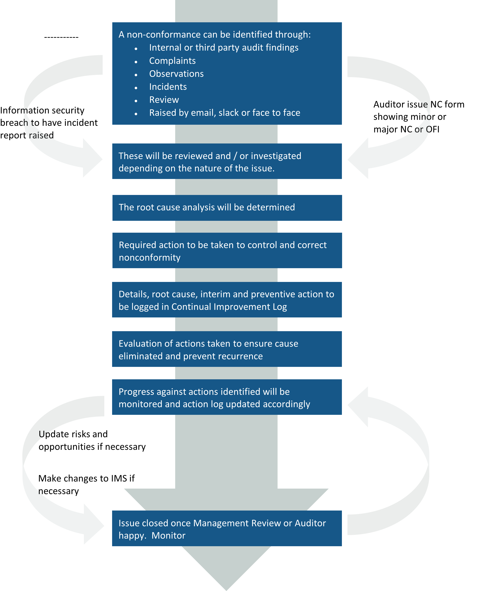

# Nonconformity and Corrective Action Procedure 

## Purpose 

This procedure outlines the mechanism for identification, reporting and investigation of non-conformance and initiating corrective actions. 

## Scope 

This procedure applies to all Rowe IT employees. 

